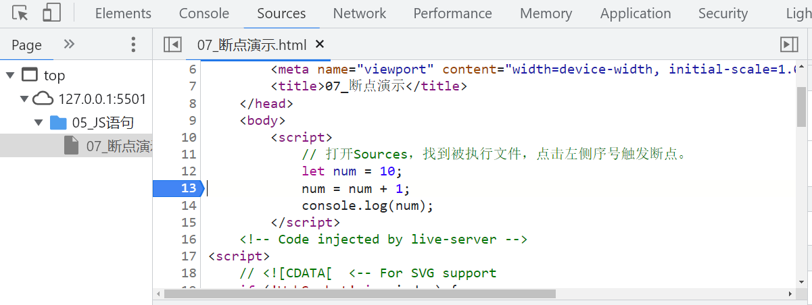
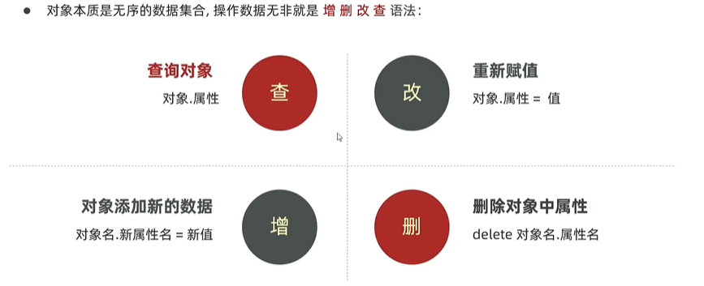
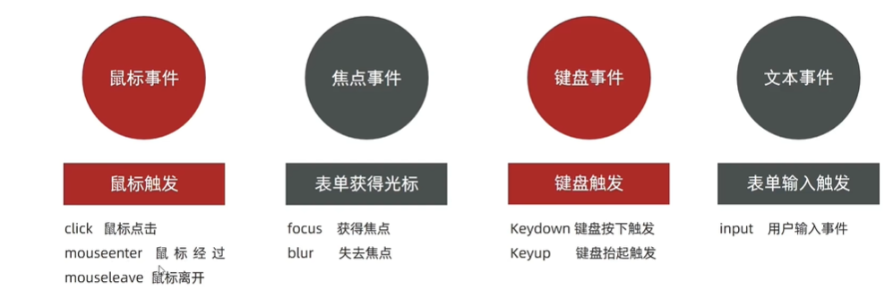
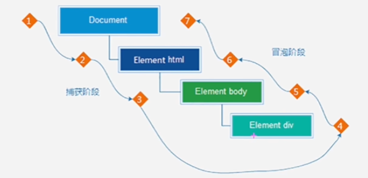
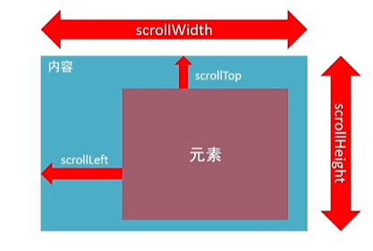
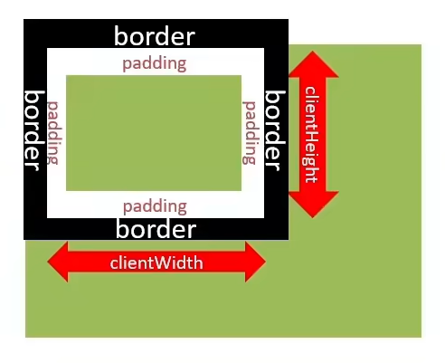
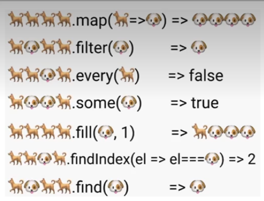
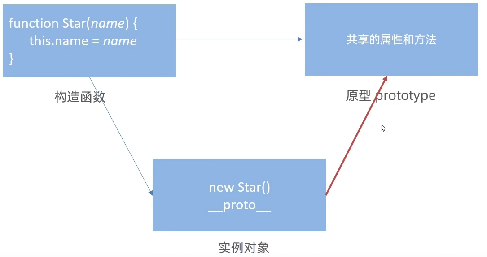
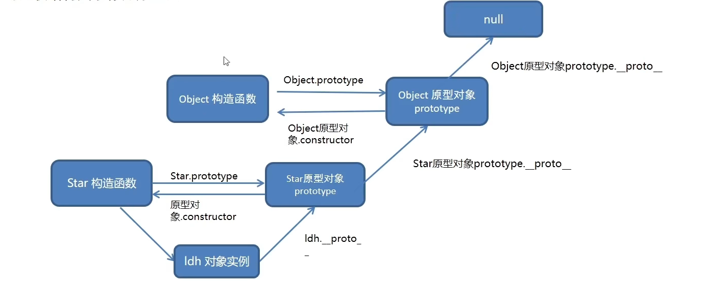

# frontend-js-learning

[TOC]

前端三件套：

https://www.bilibili.com/read/cv5650633

【JS基础】

https://www.bilibili.com/video/BV1YW411T7GX?p=122&spm_id_from=pageDriver&vd_source=b850b3a29a70c8eb888ce7dff776a5d1

https://www.bilibili.com/video/BV1Y84y1L7Nn/?p=200&spm_id_from=pageDriver&vd_source=b850b3a29a70c8eb888ce7dff776a5d1

NodeJS：https://www.bilibili.com/video/BV1a34y167AZ/?p=2&spm_id_from=pageDriver&vd_source=b850b3a29a70c8eb888ce7dff776a5d1

【MDN】前端开发者文档网站

https://developer.mozilla.org/zh-CN/

【有空，听听】

https://www.bilibili.com/video/BV1Sy4y1C7ha?p=9&vd_source=b850b3a29a70c8eb888ce7dff776a5d1


# 一、JavaScript介绍

## 1、历史

### 1.1、起源

- JavaScript诞生于1995年，它的出现主要是用于处理网页中的前端验证。
- 所谓的前端验证，就是指检查用户输入的内容是否符合一定的规则。
- 比如：用户名的长度，密码的长度，邮箱的格式等。

### 1.2、简史

- JavaScript是由网景公司发明，起初命名LiveScript，后来由于SUN公司的介入更名为JavaScript。
- 1996年微软公司在其最新的IE3浏览器中引入了自己对JavaScript的实现JScript。
- 于是在市面上存在两个版本的JavaScript，一个网景公司的JavaScript和微软的JScript。
- 为了确保不同的浏览器上运行的JavaScript标准一致，所以几个公司共同定制了JS的标准名命名为ECMAScript。

### 1.3、时间表

| 年份 | 事件                                |
| ---- | ----------------------------------- |
| 1995 | 网景公司开发了JavaScript            |
| 1996 | 微软发布了和JavaScript兼容的JScript |
| 1997 | ECMAScript第一版（ECMA-262)         |
| 1998 | ECMAScript第二版                    |
| 1998 | DOM Level1的制定                    |
| 1998 | 新型语言DHTML登场                   |
| 1999 | ECMAScript第三版                    |
| 2000 | DOM Level2的制定                    |
| 2002 | ISO/IEC 16262:2002的确定            |
| 2004 | DOM Level3的制定                    |
| 2005 | 新型语言AJAX登场                    |
| 2009 | ECMAScript第五版                    |
| 2009 | 新型语言HTML5登场                   |

### 1.4、实现

- ECMAScript是一个标准，而这个标准需要由各个厂商去实现。
- 不同的浏览器厂商对该标准会有不同的实现。

| 浏览器            | JavaScript实现方式 |
| ----------------- | ------------------ |
| FireFox           | SpiderMonkey       |
| Internet Explorer | JScript/Chakra     |
| Safari            | JavaScriptCore     |
| **Chrome**        | **v8**             |
| Carakan           | Carakan            |

- 我们已经知道ECMAScript是JavaScript标准，所以一般情况下这两个词我们认为是一个意思。
- 但是实际上JavaScript的含义却要更大一些。
- 一个完整的JavaScript实现应该由以下三个部分构成：


### 1.5、特点

- JS的特点

  - 解释型语言
  - 类似于 C 和 Java 的语法结构
  - 动态语言
  - 基于原型的面向对象

### 1.6、关键字和保留字符

- 关键字

| break    | do      | instanceof | typeof | case    |
| -------- | ------- | ---------- | ------ | ------- |
| else     | new     | var        | catch  | finally |
| return   | void    | continue   | for    | switch  |
| while    | default | if         | throw  | delete  |
| in       | try     | function   | this   | with    |
| debugger | false   | true       | null   |         |

- 保留字符

| class  | enum       | exteneds | super     | const  |
| ------ | ---------- | -------- | --------- | ------ |
| export | implements | let      | private   | public |
| yield  | interface  | package  | protected | static |

- 其他不建议使用的标识符

| abstract  | double     | goto           | native             | static             |
| --------- | ---------- | -------------- | ------------------ | ------------------ |
| boolean   | enum       | implements     | package            | super              |
| byte      | export     | import         | private            | synchronize        |
| char      | extends    | int            | protected          | throws             |
| class     | final      | interface      | public             | transient          |
| const     | float      | long           | short              | volatile           |
| arguments | encodeURI  | Infinity       | Number             | RegExp             |
| undefined | isFinite   | Object         | String             | Boolean            |
| Error     | RangeError | parseFloat     | SyntaxError        | Date               |
| eval      | JSON       | ReferenceError | TypeError          | decodeURI          |
| EvalError | Math       | URIError       | decodeURIComponent | Function           |
| NaN       | isNaN      | parseInt       | Array              | encodeURIComponent |

# 二、JavaScript基础

## 1、JavaScript是什么

### 1.1、JavaScript（是什么？）

是一种运行在客户端（浏览器）的编程语言，实现人机交互效果。

### 1.2、作用（做什么？）

- 网页特效（监听用户的一些行为，让网页作出对应的反馈）
- 表单验证（针对表单数据的合法性进行判断）
- 数据交互（获取后台的数据，渲染到前端）

- 服务端编程（Node.js）

### 1.3、JavaScript的组成（有什么？）

- ECMAScript - JavaScript语言基础
  - 规定了JS基础语法核心知识。比如：变量、分支语句、循环语句、对象等等。
- Web APIs
  - DOM - 页面文档对象模型
    - 操作文档，比如对页面元素进行移动、大小、添加删除等操作。
  - BOM - 浏览器对象模型
    - 操作浏览器，比如页面弹窗，检测窗口宽度、存储数据到浏览器等等。

JavaScript权威文档网站：https://developer.mozilla.org/zh-CN/docs/Web/JavaScript

## 2、JavaScript的书写位置

- 目标：知道如何向页面添加JavaScript

### 2.1、CSS位置

- 行内样式表
- 内部样式表
- 外部样式表

### 2.2、JavaScript位置

- 行内JavaScript
- 内部JavaScript
- 外部JavaScript

## 3、JavaScript怎么写注释

目标：了解JavaScript注释写法以及结束符通俗写法。

- 注释
  - 单行注释
    - 符号：`//`
    - 作用：`// 右边这一行的代码会被忽略`
  - 块注释
    - 符号：`/* */`
    - 作用：在`/*`和`*/`直接的所有内容都会被忽略。
- 结束符
  - 作用：使用英文的`;`代表语句结束
  - 实际情况：实际开发中，可写可不写，浏览器（JavaScript引擎）可以自动推断语句的结束位置
  - 现状：在实际开发中，越来越多的人主张，书写JavaScript代码时省略结束符。
  - 约定：为了风格统一，结束符要么每句都写，要么每句都不写（按照团队要求.）

## 4、JavaScript输入输出语法

目标：能写出常见JavaScript输入输出语法。

### 4.1、输出语法：

- 语法1：
  - 作用：向body内输出内容
  - 注意：如果输出的内容写的是标签，也会被解析成网页元素

```js
document.write("要输出的内容")
```

- 语法2：
  - 页面弹出警告对话框

```js
alert("要输出的内容")
```

- 语法3：
  - 作用：控制台输出语法，程序员调试使用

```js
console.log("控制台打印")
```

### 4.2、输入语法

- 语法：
  - 作用：显示一个对话框，对话框中包含一条文字信息，用来提示用户输入文字

```js
prompt("请输入您的姓名：")
```

## 5、JavaScript代码执行顺序

- 按HTML文档流顺序执行JavaScript代码
- `alert()`和`prompt()`它们会跳过页面渲染优先被执行（目前作为了解，后期讲解详细执行的过程）

# 三、JavaScript字面量、变量、常量

## 1、JavaScript字面量

目标：能说出什么是字面量

在计算机科学中，字面量（literal）是在计算机中描述 事/物

比如：

- 我们工资是： `1000` 此时 1000 就是数字字面量
- `"这是字面量"` 字符串字面量
- true 或 false 布尔型字面量
- `[]` 是数组字面量，`{}` 则是对象的字面量等等。

## 2、JavaScript变量

### 2.1、变量是什么？

问题1：用户输入的数据我们如何存储起来？

目标：理解变量是计算机存储数据的“容器”

**1.变量**

- 白话：变量就是一个装东西的盒子。
- 通俗：变量是计算机中用来存储数据的“容器”，它可以让计算机变得有记忆。
- 注意：<span style="color:red;font-weight:bold;">变量不是数据本身，它们仅仅是一个用于存储数值的容器。可以理解你为是一个个用来装东西的纸盒子。</span>

### 2.2、变量的基本使用

**1.声明变量：**

要想使用变量，首先需要创建变量（也称为声明变量或者定义变量）

**语法：**

```js
let 变量名
```

- 声明变量有两部分构成：声明关键字、变量名（标识）
- let即关键字（let：允许、许可、让、要），所谓关键字是系统提供的专门用来声明（定义）变量的词语

**2.变量赋值：**

定义了一个变量后，你就能够初始化它（赋值）。在变量名之后跟上`=`，然后是数值。

简单点，也可以声明变量的时候直接完成赋值操作，这种操作也称为变量**初始化**。

```js
let age = 18;
```

**3.更新变量：**

变量赋值后，还可以通过简单地给它一个不同的值来更新它。

**4.声明多个变量：**

**语法：**多个变量中间用逗号隔开。

```js
let age = 18, uname = "pink";
```

**说明**：看上去代码长度更短，但是并<span style="color:red;">不推荐这样</span>。为了更好的可读性，请一行只声明一个变量。

### 2.3、变量的本质

目标：能够说出变量的本质是什么。

**内存：**计算机中存储数据的地方，相当于一个空间。

**变量本质：**是程序在内存中申请的一块用来存放数据的小空间。

### 2.4、变量的命名规范和规则

目标：能写出符合规范的变量名。

**规则：**必须遵守，不遵守会报错。

**规范：**建议，不遵守不会报错，但不符合业内通识。


- 规则：
  - 不能使用关键字
    - 关键字：有特殊含义的字符，JavaScript内置的一些英语词汇。例如：let、var、if、for等等。
  - 只能使用下划线、字母、数字、$组成，且数字不能开头
  - 字母严格区分大小写，例如`Age`和`age`是不同的变量
- 规范：
  - 起名要有意义
  - 遵守小驼峰命名法
    - 第一个单词首字母小写，后面每个单词首字母大写。例如：userName

### 2.5、变量拓展-let和var区别

**let和var区别：**

在旧的JavaScript，使用关键字var来声明变量，而不是let。

var现在开发中一般不再使用，只是我们可能再老版本程序汇总看到它。

let为了解决var的一些问题。

- var声明：
  - 可以先使用，再声明（不合理）
  - var声明过的变量可以重复声明（不合理）
  - 比如变量提升、全局变量、没有块级作用域等等

**结论：**<span style="color:red;font-weight:bold">var就是一个bug，别迷恋它，以后声明变量我们统一使用let。</span>

### 2.6、变量拓展-数组

- 数组（Array）——一种将**一组数据存储在单个变量名下**的优雅方式。

```js
let arr = [];
```

**1.声明语法：**

```tex
let 数组名 = [数据1,数据2,...数据n]
```

- 在数组中，数据的编号也叫**索引或下标**
- 数组是按顺序保存，所以每个数据都有自己的编号
- 计算机中的编号从0开始

**2.一些术语：**

- 元素：数组中保存的每个数据都叫做数组元素。
- 下标：数组中数据的编号。
- 长度：数组中数据的个数，通过数组的`length`属性获得。

## 3、常量

- **概念：**使用const声明的变量称为“常量”。
- **使用场景：**当某个变量永远不会改变的时候，就可以使用`const`来声明，而不是`let`。
- **命名规范：**和变量一致。

- **常量使用：**

```js
// 声明一个常量
const G = 9.8
```

- **注意：**<span style="color:red;font-weight:bold;">常量不允许重新赋值，声明的时候必须赋值（初始化）</span>

- **小技巧：**<span style="color:red;">**不需要重新赋值的数据使用const**</span>

# 四、JavaScript数据类型

**目标：能说出JS中基本数据类型有哪些。**

计算机世界中的万事万物都是数据。

计算机程序可以处理大量的数据，为什么要给数据分类？

- 更加充分和高效的利用内存
- 也更加方便程序员使用数据

**JS数据类型整体分为两大类：**

- 基本数据类型
  - number - 数字型
  - string - 字符串型
  - boolean 布尔型
  - undefined - 未定义型
  - null - 空类型
- 引用数据类型
  - object - 对象

## 1、数字类型（number）

即我们数学中学习到的数字，可以是整数、小数、正数、负数。

```js
let age = 18; // 整数
let price = 88.99; // 小数
```

JavaScript中的正数、负数、小数等统一称为数字类型。

**注意事项：**

- JS是弱数据类型，变量到底属于哪一种数据类型，只有赋值之后，我们才能确认。
- Java是强国数据类型，例如 int a = 3 必须是整数

数字可以由很多操作，比如：乘法`*`、除法`\`、加法`+`、减法`-`等等，所以经常和算术运算符一起。

数学运算符也叫做**算术运算符**，主要包括加、减、乘、除、取余（取模）。

- +：求和
- -：求差
- *：求积
- /：求商
- %：取模（取余数）
  - 开发中经常作为某个数字是否被整除

**算术运算符的优先级：**

同时使用多个运算符编写程序时，会按着某种顺序先后执行，我们称为优先级。

JavaScript中优先级越高越先被执行，<span style="color:red;">优先级相同时以书写顺序从左到右执行。</span>

- 乘、除、取模优先级相同
- 加、减优先级相同
- 乘、除、区域优先级大于加、减
- 使用`()`可以提升优先级
- 总结：先乘除后加减，有括号先算括号里面的~~~

**数字类型中特殊的值：**

NaN代表一个计算错误。它是一个不正确的或者一个未定义的数学操作所得到的结果。

```js
console.log("老师" - 2); // NaN
```

NaN是粘性的。任何对NaN的操作都会返回NaN

```js
console.log(NaN + 2); // NaN
```

## 2、字符串型（string）

<span style="color:red;font-weight:bold;">通过单引号`''`、双引号`""`或者反引号&#96;包裹的数据都叫字符串</span>，单引号和双引号没有本质上的区别，推荐使用单引号。

```js
let uname = '小明'; // 使用单引号
let gender = "男"; // 使用双引号
let goods = `小米`; // 使用反引号
let tel = "13612345678"; // 也是字符串
let ctn = "外面的使用双引号，内部的使用'单引号'";
let str = ""; // 这种情况叫空字符串
```

**注意事项：**

1. 无论单引号或者双引号，必须成对出现。
2. 单引号/双引号可以互相嵌套，但是不能自己嵌套自己（口诀：外单内双，或者外双内单）
3. 必要时可以使用转义符`\`，输出单引号或双引号。

**字符串拼接：**

**场景：**+运算符，可以实现字符串的拼接。

**口诀：**数字相加，字符相连。

**模板字符串：**

- 使用场景

  - 拼接字符串和变量
  - 在没有它之前，要拼接变量比较麻烦

  ```js
  document.write("大家好，我叫" + name + "，今年" + age + "岁了！")
  ```

- 语法

  - ``（反引号）
  - 在英文输入模式下按键盘的TAB键上方的那个键（数字1左边的按键）
  - 内容拼接变量时，用`${}`包裹住变量

  ```js
  document.write(`大家好，我叫${name}，今年${age}岁了！`)
  ```

## 3、布尔型（boolean）

表示肯定或者否定时在计算机中对应的是布尔类型的数据。

它有两个固定的值`true`和`false`，表示肯定的数据用`true`（真），表示否定的数据用`false`（假）。

```js
// JavaScript 好玩不？
let isCool = true;
console.log(isCool);
```

## 4、未定义类型（undefined）

未定义是比较特殊的类型，只有一个值：`undefined`。

**什么情况出现未定义类型？**

只声明变量，不赋值的情况下，变量的默认值为undefined，一般很少【直接】为某个变量赋值为undefined。

```js
let num; // 声明变量但是未赋值
console.log(num); // undefined
```

**工作中使用的场景：**

我们开发中经常声明一个变量，等待传送过来的数据。

如果我们不知道这个数据是否传递过来，此时我们可以通过检测这个变量是不是undefined，就能判断用户是否有数据传递过来。

## 5、null（空类型）

JavaSc中的null仅仅是一个代表“无”、“空”或“值未知”的特殊值。

## 6、检测数据类型

**通过<span style="color:red;">typeof</span>关键字检测数据类型**

typeof运算符可以返回被检测的数据类型，它支持两种语法形式：

1. 作为运算符：typeof x （常用的写法）
2. 函数形式：typeof(x)

换言之，有括号和没有括号，得到的结果是一样的，所以我们直接使用<span style="color:red;">运算符</span>的写法。

## 7、隐式转换和显示转换

**1、为什么需要类型转换：**

JavaScript是弱数据类型：JavaScript也不知道变量到底属于哪一种数据类型，只有赋值了才清楚。

坑：使用表单、prompt获取过来的数据默认是字符串类型的，此时就不能直接简单的进行加法运算。

```js
console.log('10000' + '2000'); // 输出结果 100002000
```

此时需要转换变量的数据类型。

通俗来讲，<span style="color:red;">就是把一种数据类型的变量转换成我们需要的数据类型</span>。

**2.隐式转换**

某些运算符被执行时，系统内部自动将数据类型进行转换，这种转换称为隐式转换。

**规则：**

- +号两边只要有一个是字符串，都会把另外一个转成字符串。
- 除了+以外的算术运算符，比如`-`、`*`、`/`等都会把数据转成数字类型。

**缺点：**

- 转换类型不明确，靠经验才能总结。

**小技巧：**

- +号作为正好解析可以转换数字类型
- 任何数据和字符串相加结果都是字符串

**3.显示转换：：**

编程时过渡依靠系统内部的隐式转换是不严谨的，因为隐式转换规律并不清晰，大多是靠经验总结的规律。

为了避免因为隐式转换带来的问题，通常根据逻辑需要对数据进行显示转换。

**概念：**

自己写代码告诉系统该转换成什么类型。

**转换为数字类型：**

- Number(数据)
  - 转成数字类型
  - 如果字符串内容里有非数字，转换失败时结果为NaN（Not a Number）即不是一个数字
  - NaN也是number类型的数据，代表非数字
- parseInt(数据)
  - 只保留整数
- parseFloat（数据）
  - 可以保留小数

**转换为Boolean型**

- 显式转换：
  - Boolean(内容)
    - 记忆：<span style="color:red;">''、0、undefined、null、false、NaN转换为布尔值后都是false，其余则为true</span>
- 隐式转换：
  - 有字符串的加法： `"" + 1`，结果是： `"1"`
  - 减法 - (像大多数数学运算一样）只能用于数字，它会使空字符串 "" 转换为 0
  - null 经过数字转换之后会变为 0
  - undefined 经过数字转换之后会变成 NaN

# 五、运算符

## 1、赋值运算符

目标：能够使用赋值运算符简化代码

- 赋值运算符：对变量赋值的运算符
  - 已经学过的赋值运算符：= <span style="color:red;">将等号右边的值赋予给左边，要求左边必须是一个容器</span>
  - 其他赋值运算符：
    - +=
    - -=
    - *=
    - /=
    - %=
- 使用这些运算符可以在堆变量赋值时进行快速操作

## 2、一元运算符

目标：能够使用一元运算符做自增运算

众多的JavaScript的运算符可以根据所需表达式的个数，分为一元运算符、二元运算符、三元运算符

- 二元运算符

  - 例子：

  ```js
  let num = 10 + 20;
  ```

- 一元运算符

  - 正负号：`+`和`-`
  - 自增自减：`++`和`--`

## 3、比较运算符

**目标：**能使用场景的比较运算符进行比较运算

- 比较运算符的介绍

  - 使用场景：比较两个数据大小、是否相等
  - 实际运用示例：

- 比较运算符

  - `>`：左边是否大于右边
  - `<`：左边是否小于右边
  - `>=`：左边是否大于等于右边
  - `<=`：左边是否小于等于右边
  - `==`：左右两边值是否相等
  - `===`：左右两边是否类型和值都相等【推荐】
  - `!=`：左右两边是否不等
  - `!==`：左右两边是否不全等

  - 比较结果为boolean类型，即只会得到true或false

- 字符串比较，是比较的字符对应的ASCII码

- NaN不等于任何值，包括它本身

  - 涉及到“NaN”都是false

- 尽量不要比较小数，因为小数有精度问题

- 不同类型之间比较会发生隐式转换

  - 最终把数据隐式转换成number类型再比较
  - 所以开发中，如果进行准确比较我们更喜欢`===`，或者`!==`。

## 4、逻辑运算符

**目标：**掌握逻辑运算符，为程序“能思考”做准备。

### 4.1、逻辑运算符的介绍

- **提问：**如果我想判断一个变量num是否大于5，且小于10，怎么办？
  - 错误写法：5<num<10
- **使用场景：**逻辑运算符用来解决多重条件判断。
  - 正确写法： num > 5 && num < 10

### 4.2、逻辑运算符的使用

| 符号 | 名称   | 日常读法 | 特点                         | 口诀           |
| ---- | ------ | -------- | ---------------------------- | -------------- |
| &&   | 逻辑与 | 并且     | 符号两边都为true，结果是true | 一假则假       |
| \|\| | 逻辑或 | 或者     | 符号两边有一个true就为true   | 一真则真       |
| !    | 逻辑非 | 取反     | true变false，false变true     | 真变假，假变真 |

### 4.3、逻辑中断

开发中，还会见到以下的写法：

```js
function fn(x, y) {
    x = x || 0;
    y = y || 0;
    console.log(x + y);
}
```

- 这种类似于参数的默认值的写法，叫做逻辑中断。

- 逻辑运算符里的短路

  - 短路：只存在于 && 和 || 中，当满足一定条件会让右边代码不执行。

  | 符号 | 短路条件            |
  | ---- | ------------------- |
  | &&   | 左边为 false 就短路 |
  | \|\| | 左边为 true 就短路  |

  - 原因：通过左边能得到整个表达式的结果，因此没必要再判断右边。
  - 运算结果：无论 && 还是 ||，运算结果都是最后被执行的表达式值，一般用在变量赋值。

## 5、运算符优先级

目标：掌握运算符的优先级，能判断运算符的执行顺序。

| 优先级 | 运算符     | 顺序                    |
| ------ | ---------- | ----------------------- |
| 1      | 小括号     | `()`                    |
| 2      | 一元运算符 | `++` `--` `!`           |
| 3      | 算术运算符 | 先`*` `/` `%` 后`+` `-` |
| 4      | 关系运算符 | `>` `>=` `<` `<=`       |
| 5      | 相等运算符 | `==` `!=` `===` `!==`   |
| 6      | 逻辑运算符 | 先`&&` 后 `||`          |
| 7      | 赋值运算符 | `=`                     |
| 8      | 逗号运算符 | `,`                     |

- 一元运算符里面的<span style="color:red;">逻辑非优先级很高</span>
- <span style="color:red;">逻辑与比逻辑或优先</span>

# 六、语句

## 6.1、表达式和语句

**目标：**能说出表达式和语句的区别

- 表达式：

表达式是可以被求值的代码，JavaScript引擎会将其计算出一个结果。

```js
x = 7;
3 + 4;
num++;
```

- 语句：

语句是一段可以执行的代码。

比如：prompt()可以弹出一个输入框，还有if语句，for循环语句等等。

- 区别：

表达式：因为表达式可以被求值，所以它可以写在赋值语句的右侧。比如：`num=3+4`

语句：而语句不一定有值，所以比如`alert()` `for`和`break`等语句就不能被用于赋值。比如：`alert()`弹出对话框，`console.log()`控制台打印输出。

## 6.2、分支语句

目标：掌握流程控制，写出能“思考”的程序。

### 6.2.1、程序三大流程控制语句

- **顺序结构：**从上往下执行语句。
- **分支结构：**根据条件选择执行代码。
- **循环结构：**代码被重复执行。

### 6.2.2、分支语句

- 分支语句可以让我们有<span style="color:red;">选择性</span>的执行想要的代码。
- 分支语句包含：
  - <span style="color:red;">if分支语句</span>
  - <span style="color:red;">三元运算符</span>
  - <span style="color:red;">switch语句</span>

**1.if分支语句**

- if语句有三种使用：单分支、双分支、多分支
- 单分支使用语法：
  - 括号内的条件为true时，进入大括号里执行代码
  - 小括号内的结果若不是布尔类型时，会发生隐式转换为布尔类型
  - 如果大括号只有一个语句，大括号可以省略，但是不提倡

```js
if (条件) {
    满足条件要执行的代码
}
```

- 双分支if语法：

```js
if (条件) {
	满足条件要执行的代码
} else {
    不满足条件要执行的代码
}
```

- 多分支if语法

**使用场景：**适合于有多个结果的时候，比如学习成绩可以分为：优、良、中、差。

```js
if (条件1) {
    
} 
else if (条件2) {
    
} 
else if (条件3) {
    
} else {
    
}
```

**2.三元运算符**

**目标：能利用三元运算符执行满足条件的语句。**

- **使用场景：**其实是比if双分支更简单的写法，可以使用三元表达式。
- **符号：**?与:配合使用
- **语法：**

```js
条件 ? 满足条件执行的代码 : 不满足条件执行的代码
```

- 一般用来取值

**3.switch语句**

目标：能利用switch执行满足条件的语句。

```js
switch (数据) {
    case 值1:
        代码1;
        break;
    case 值2:
        代码2;
        break;
    default:
        代码n;
        break;
}
```

- 找到和小括号里数据**全等**的case值，并执行里面对应的代码。
- 若没有**全等`===`**则执行default里的代码。
- switch case语句一般用于等值判断，不适合于区间判断。
- switch case一般需要配合break关键字使用，没有break会造成case逻辑穿透。

## 6.3、循环语句

目标：掌握循环结构，实现一段代码重复执行。

### 6.3.1、断点调试

> 打开Sources，找到被执行文件，点击左侧序号触发断点。



### 6.3.2、while循环

**循环：**重复执行一些操作，**while:**在...期间，所以**while循环**就是在**满足条件**期间，重复执行某些代码。

**1.while循环基本语法：**

```js
whhile (循环条件) {
    要重复执行的代码(循环体)
}
```

- 跟if语句很像，都要满足小括号里的条件为true才会进入**循环体**执行代码。
- while大括号里代码执行完毕后不会跳出，而是继续回到小括号里判断条件是否满足，若满足又执行大括号里的代码，然后再回到小括号判断条件，直到括号内条件不满足，即跳出。

**2.while循环三要素：**

循环的本质就是以某个变量为起始值，然后不断产生变化量，慢慢靠近终止条件的过程。

所以，<span style="color:red;">while循环需要具备三要素：</span>

1. 变量起始值
2. 终止条件（没有终止条件，循环会一直执行，造成死循环）
3. 变量变化量（用自增或者自减）

```js
let i = 1;
while (i <= 3) {
	document.write("我会循环三次<br>");
    i++;
}
```

### 6.3.3、循环的退出

**目标：**能说出 continue 和 break 的区别。

**循环结束：**

- break：退出循环
- continue：结束本次循环，继续下次循环。

### 6.3.4、for循环

目标：掌握for循环重复执行某些代码。

**1.for循环语法**

```js
for (变量起始值; 终止条件; 变量变化量) {
    // 循环体
}
```

**2.for循环嵌套**

```js
for (外部声明记录循环次数的变量; 循环条件; 变化值) {
    for (内部声明记录循环次数的变量; 循环条件; 变化值) {
        // 循环体
    }
}
```

- 一个循环里再套一个循环，一般用在for循环里。


### 6.3.5、for和while区别

- 如果明确了循环次数，推荐for循环。
- 如果不明确循环次数，推荐while循环。


# 七、数组

## 7.1、数组是什么

**目标：**能说出数组是什么

- 数组：（Array）是一种可以按顺序保存数据的<span style="color:red;">数据类型</span>
- 为什么要数组？
  - 思考：如果我想保存一个班里所有同学的姓名怎么办？
  - <span style="color:red;">场景：如果有多个数据可以用数组保存起来，然后放到一个变量中，管理非常方便。</span>

## 7.2、数组的基本使用

**目标：**能够声明数组，并且能够获取里面的数据。

**1、声明语法**

```js
let 数组名 = [数据1, 数据2, ..., 数据n]
// 或
let 数组名 = new Array(数据1, 数据2, ..., 数据n);
```

- 例子

```js
let arr = [1, 2, "pink", true];
```

- 数组是按顺序保存，所以每个数据都有自己的编号
- 计算机中的编号从0开始，比如 arr[2]="pink"。
- 在数组中，数据的编号也叫<span style="color:red;">索引或下标</span>。
- 数组可以存储任意类型的数据。


**2、取值语法**

```js
数组名[下标]
// 备注：下标可以是数字，也可以是数字字符串，比如 数组名[0] 和 数组名["0"] 都是OK的。
```

- 例子：

```js
let arr = [1, 2, "pink", true];
arr[0] // 1
arr[3] // true
```

- 通过下标取数据
- 取出来是什么类型的，就根据这种类型特点来访问

**3、一些术语**

- 元素：数组中保存的每个数据都叫数组元素
- 下标：数组中数据的编号
- 长度：数组中数据的个数，通过数组的length属性获得

```js
let names = ['小明', '小刚', '小红', '小丽', '小米'];
console.log(names[0];
console.log(names[1];
console.log(names.length); // 5
```

**4、遍历数组（重点）**

目标：能够遍历输出数组里面的元素

- 用循环把数组中每个元素都访问到，一般会用for循环遍历
- 语法：

```js
for (let i = 0; i < 数组名.length; i++){
    数组名[i]
}
```

```js
let nums = [10, 20, 30, 40, 50];
for (let i = 0; i < nums.length; i++) {
    document.write(nums[i]);
}
```


## 7.3、操作数组

- 数组本质是数据集合，操作数据无非就是<span style="color:red;">增删改查</span>语法：


### 7.3.1、操作数组-新增

**目标：**掌握利用push向数组添加元素（数据）

- <span style="color:red;">数组.push</span>方法将一个或多个元素添加到数组的**末尾**，并返回该数组的新长度（<span style="color:red;">重点</span>）

  - **语法：**

  ```js
  arr.push(元素1, ..., 元素n)
  ```

  - **例如：**

  ```js
  let arr = ["red", "green"];
  arr.push("pink");
  console.log(arr); // ["red", "green", "pink"]
  ```

- <span style="color:red;">arr.unshift(新增的内容)</span>方法将一个或多个元素添加到数组的**开头**，并返回该数组的新长度<span style="color:red;">（<span style="color:red;">重点</span>）</span>

  - **语法：**

  ```js
  arr.unshift()
  ```

### 7.3.2、操作数组-删除

**目标：**能够删除数组元素（数据）

- <span style="color:red;">数组.pop()</span>方法从数组中删除**最后一个**元素，并返回该元素的值。此方法会更改数组的长度。

  - **语法：**

  ```js
  arr.pop()
  ```

  - **例如：**

  ```js
  let arr = ["red", "green"];
  arr.pop();
  console.log(arr); // ["red"]
  ```

- <span style="color:red;">数组.shift()</span> 方法从数组中删除**第一个**元素，并返回该元素的值。此方法更改数组的长度。

  - **语法：**

  ```js
  arr.shift()
  ```

- <span style="color:red;">数组.splice()</span>方法通过**移除**或者**替换**已存在的元素和/或**添加新元素**[就地](https://zh.wikipedia.org/wiki/原地算法)改变一个数组的内容。返回值是一个包含了删除的元素的数组。

  - **语法：**

  ```js
  arr.splice(start, deleteCount);
  arr.splice(起始位置, 删除几个元素);
  ```

  - **解释：**
    - start 起始位置：指定修改的开始位置（从0计数）。
    - deleteCount：表示要移除的数组元素的个数。
      - 可选的，如果省略则默认从指定的起始位置删除到最后。

## 7.4、数组中map方法

- **使用场景：**

map可以遍历数组<span style="color:red;">处理数据</span>，并返<span style="color:red;font-weight:bold;">返回新的数组</span>

```js
const arr = ['red', 'blue', 'green'];
const newArr = arr.map(function(ele, index){
	console.log(ele)   ; // 数组元素
    console.log(index); // 数组索引号
    return ele+'颜色';
});
console.log(newArr); // ['red颜色', 'blue颜色', 'green颜色']
```

<span style="color:red;font-weight:bold;">map也称为映射</span>。映射是一个术语，指两个元素的集之间元素相互“对应”的关系。

<span style="color:red;font-weight:bold;">map重点在于有返回追</span>，forEach没有返回值。

## 7.5、数组中join方法

- **作用：**

  join()方法用于把数组中的所有元素转换一个字符串。

- **语法：**

  ```js
  const arr = ['red颜色', 'blue颜色', 'green颜色'];
  console.log(arr.join('')); // red颜色blue颜色green颜色
  ```


## 7.6、数组的forEach方法（重点）

- forEach()方法用于调用数组的每个元素，并将元素传递给回调函数。
- 主要使用场景：**变量数组的每个元素**
- 语法：

```js
被遍历的数组.forEach(function(当前数组元素,当前元素索引号)){
	// 函数体
   }
```

- 示例：

```js
const arr = ["red", "green", "pink"];
arr.forEach(function (ele, idx) {
    console.log(ele, idx);
});
```

注意：

1. forEach主要是变量数组。
2. 参数当前数组元素是必须的，索引号是可选的。

## 7.7、数组filter方法（重点）

- fiilter()方法创建一个新的数组，新数组中的元素是通过检查指定数组中复合条件的所有元素。
- 主要使用场景：<span style="color:red;font-weight:bold;">筛选数组中复合条件的元素</span>，并返回筛选之后元素的新数组。
- **返回值：**返回数组，包含了符合条件的所有元素。如果没有符合条件的元素则返回空数组。
- **参数：**参数当前数组元素是必须的，索引号是可选。
- **语法：**

```js
const arr = [10, 20, 30];
const newArr = arr.filter(function (item, index) {
    return item >= 20;
});
console.log(newArr); // [20, 30]
```

## 7.8、forin方法

```js
const arr = [10, 20, 30];
for (let i in arr) {
    console.log(i, arr[i]); // 0 10
}
```


# 八、函数

## 8.1、为什么需要函数

**目标：**能说出为什么需要函数

- **函数：**

function，是被设计为<span style="color:red;">执行特定任务</span>的代码块。

- **说明：**

函数可以把具有相同或者相似逻辑的代码“包裹”其拉力，通过函数调用执行这些被”包裹“的代码逻辑，这么做的优势是有利于<span style="color:red;">精简代码方便复用</span>。

比如，我们前面使用的alert()、prompt()和console.log()都是一些js**函数**，只不过已经封装好了，我们直接使用的。

## 8.2、函数的使用

**目标：**掌握函数语法，把代码封装起来

- 函数的声明语法

```js
function 函数名() {
    函数体
}
```

- 函数名命名规范
  - 和变量命名基本一致
  - 尽量小驼峰式命名法
  - 前缀应该为动词
  - 命名建议：常用动词约定

```js
function getName(){}
function addSquares(){}
```

- 函数的调用语法

```js
// 函数调用，这些函数体内的代码逻辑会被执行
函数名()
```

注意：声明（定义）的函数必须调用才会真正被执行，使用()调用函数。

- 函数体

函数体是函数的构成部分，它负责将相同或相似代码“包裹”起来，直到函数调用时函数体内的代码才会被执行。函数的功能代码都要写在函数体当中。

## 8.3、函数传参

- 声明语法

```js
function 函数名(参数列表) {
	函数体
}
```

- 参数列表
  - 传入数据列表
  - 声明这个函数需要传入几个数据
  - 多个数据用逗号隔开

- 调用语法

```js
函数名(传递的参数列表)
```

- 函数传参

  - 形参：声明函数是写在函数右边小括号里面的叫形参（形式上的参数）

  - 实参：调用函数时写在函数名右边小括号里面的叫实参（实际上的参数）

  - <span style="color:red;">形参可以理解为是</span>这个函数内声明的<span style="color:red;">变量</span>（比如num1=10）；实参可以理解为是给这个变量赋值。

  - <span style="color:red;">开发中尽量保持形参和实参个数一致</span>

  - 我们曾经使用过的alert('打印'),parse('11'),Number('11')本质上都是函数调用的传参。

  ```js
  // 形参：形式上的参数
  function getSum(start, end) {
      let sum = 0;
      for (let i = start; i <= end; i++) {
          sum += i;
      }
      console.log(sum);
  }
  getSum(1, 100); // 实参：实际的参数
  ```

- 参数默认值

  形参：可以看做变量，但是如果一个变量不给值，默认是什么？

  - undefined

  如果用户不输入实参，会有 undefined + undefined = NaN，那么如何解决？

  - 给形参默认值

  如果用户不输入实参，可以给一个<span style="color:red;">形参默认值</span>，比如，可以默认为0。

  ```js
  // 函数求和
  function getSum(num1 = 0, num2 = 0) {
      // 如果没有形参默认值，在用户不输入实参时，结果是： undefiend + undefined = NaN
      document.write(`${num1} + ${num2} = ${num1 + num2}<br>`);
  }    
  getSum(1, 2); // 1 + 2 = 3
  getSum(); // 0 + 0 = 0
  ```

  - 说明：<span style="color:red;font-weight:bold;">这个默认值只会在缺少实参传递时，才会被执行，所以有参数会优先执行传递过来的实参，否则默认为 undefined 。</span>

## 8.4、函数返回值

- 提问：什么是函数？

函数是被设计为<span style="color:red;font-weight:bold;">执行特定任务</span>的代码块。

- 提问：执行完特定任务之后，然后呢？

把任务的结果返回给我们。

- 有返回值函数的概念：
  - 当调用某个函数时，这个函数会返回一个结果出来。类似：`let result = prompt('请输入你的年龄？');`

- 函数返回值

  - 当函数需要返回数据出去时，用<span style="color:red;">return</span>关键字。
  - 语法：

  ```js
  return 数据;
  ```

  - 示例：

  ```js
  function getSum(x, y) {
      return x + y;
  }
  let num = getSum(10, 20);
  document.write(num);
  ```


- 有返回值的函数
  - 细节：
    - 在函数中使用 return 关键字能将内部的执行结果交给函数外部使用
    - return 后面代码不会再被执行，会立即结束当前函数，所以<span style="color:red;font-weight:bold;">return 后面的数据不要换行写</span>
    - return函数可以没有return，这种情况函数<span style="color:red;">默认返回值为 undefined</span>
- 函数细节补充
  - 两个相同的函数后面的会覆盖前面的函数
  - 在JavaScript中实参的个数和形参的个数可以不一致
    - 如果形参过多会自动填上undefined（了解即可）
    - 如果实参过多那么多余的实参会被忽略（<span style="color:red;">函数内部有一个arguments，里面装着所有的实参</span>）
  - 函数一旦碰到return就不会再往下执行了，函数的结束用return

## 8.5、作用域

通常来说，一段程序代码中所用到的名字并不总是有效和可用的，而限定这个名字的<span style="color:red;">可用性的代码范围</span>就是这个名字的<span style="color:red;">作用域</span>。

作用域的使用提高了程序逻辑的局部性，增强了程序的可靠性，减少了名字冲突。

- 全局作用域

  - 全局有效，作用域所有代码执行的环境（整个script标签内部）或者一个独立的js文件。

  ```js
  let num = 10; // 1.全局变量
  console.log(num); // 10
  function fn() {
      console.log(num); // 10
  }
  fn();
  ```

- 局部作用域

  - 局部有效，作用域函数内的代码环境，这就是局部作用域。因为和函数有关系，所以也称为函数作用域。

  - 示例：

  ```js
  for (let i = 0; i < 3; i++) {
      document.write("怎么回事呢？");
  }
  console.log(i); // Uncaught ReferenceError: i is not defined
  ```

  ```js
  function fun() {
      let num = 20;
      console.log(num); // 20
  }
  fun();
  console.log(num); // Uncaught ReferenceError: num is not defined
  ```

- 变量有一个坑，特殊情况：

  - 如果函数内部，变量没有声明，直接赋值，也当做<span style="color:red;">全局变量</span>看，但是强烈不推荐。

  ```js
  function fn() {
      num = 10; // 当做局部变量看，实际有全局的效果，但是不推荐
  }
  fn();
  console.log(num); // 10
  ```

  - 有一种情况，函数内部的形参可以看做是局部变量

  ```js
  function fun(x, y) {
      console.log(x); // 1
  }
  fun(1, 2);
  console.log(x); // Uncaught ReferenceError: x is not defined
  ```

- 变量的访问规则
  - 只要是代码，就至少有一个作用域。
  - 写在函数内部的局部作用域。
  - 如果函数还有函数，那么在这个作用域中就又可以诞生一个作用域。
  - 访问原则：<span style="color:red;font-weight:bold;">在能够访问到的情况下先局部，局部没有再找全局</span>
  - 采用<span style="color:red;font-weight:bold;">就近原则</span>的方式来查找变量最终的值

## 8.6、匿名函数

- 具名函数

```js
// 声明：
function fn(){};
// 调用：
fn();
```

- 匿名函数

  ```js
  function() {}
  ```

  - 没有名字的函数，无法直接使用。

  - 使用方式：

    - 函数表达式

      - 将匿名函数赋值给一个变量，并且通过变量名称进行调用，我们将这个称为<span style="color:red;font-weight:bold;">函数表达式</span>

        - 语法：

        ```js
        let fn = function() {
            // 函数体
        }
        ```

        - 调用：

        ```js
        fn() // 函数名()
        ```

        - 使用场景：

        ```html
        <body>
            <button>点击我</button>
            <script>
            	let btn = document.querySelector("button");
                btn.onclick = function() {
                    alert("我是匿名函数");
                }
                // btn.addEventListener(function(){alert("弹出！")}) // 新写法
            </script>
        </body>
        ```

    - 立即执行函数

      - 场景介绍：避免全局变量之间的污染
      - 语法：

      ```js
      // 方式1
      (function() { console.log(11); })();
      // 方式2
      (function() { console.log(11); }());
      // 方式3
      !function(){}();  
      // 方式4
      +function(){}();
      ```
      
      - 无需调用，立即执行（本质是已经调用了）
      - 多个立即执行函数之间用分号隔开。

# 九、对象

## 9.1、什么是对象

**1.对象是什么**

- 对象（object）：JavaScript里的一种数据类型。

- 可以理解为是一种无序的数据集合，注意属猪是有序的数据集合。

- 用来描述某个事务，例如描述一个人

  - 人有姓名、年龄、性别等信息、还有吃饭睡觉打代码等功能。
  - 如果用多个变量保存则比较散，用对象比较统一。

  ```js
  let obj = {
      uname: 'pink老师',
      age: 18,
      gender: '女'
  }
  ```

## 9.2、对象使用

目标：掌握对象语法，用它保存多个数据

### 9.2.1、对象声明语法

```js
let 对象名 = {};
或
let 对象名 = new Object();
```

例如：

```js
// 声明了一个person的对象
let person = {};
```

实际开发中，我们多用花括号。<span style="color:red;font-weight:bold;">{}是对象字面量</span>

- 对象是由属性和方法组成

  - 属性：信息或叫特征（名词）。比如手机尺寸、颜色、重量等...
  - 方法：功能或叫行为（动词）。比如手机打电话、发短信、玩游戏...

  ```js
  let 属性名 = {
      属性名: 属性值,
      方法名: 函数
  }
  ```

- 属性

  - 数据描述性的信息称为属性，如人的姓名、身高、年龄、性别等，一般是名词性的。

  ```js
  let obj = {
      uname: "pink老师",
      age: 18,
      gender: "女"
  }
  ```

  - 属性都是成对出现的，包括属性名和属性值，它们之间使用英文 `:` 分隔。
  - 多个属性之间使用英文 `,` 分隔。
  - 属性就是依附在对象上的变量（外面是变量，对象内是属性）。
  - 属性名可以使用`""`或者`''`，<span style="color:red;font-weight:bold;">一般情况下省略</span>，除非名称遇到特殊符号，如空格、中横线等。

### 9.2.2、对象使用

- 对象本质是无序的数据集合，操作数据无非就是<span style="color:red;font-weight:bold;">增 删 改 查</span>语法。



**1、属性-查：**

- 声明对象，并添加了若干属性后，可以使用`.`获得对象中属性对应的值，我们称之为属性的访问。
- 语法：
  - <span style="color:red;font-weight:bold;">对象名.属性</span>
  - <span style="color:red;font-weight:bold;">对象名[属性]</span>
- 两种方式有什么区别？
  - 点后面的属性名一定不要加引号；
  - []里面的属性名一定加引号
  - 后期不同使用场景会用到不同的写法
- 简单理解就是获得对象里面的属性值。

```js
let person = {
    uname: 'pink',
    age: 18,
    gender: '女'
}
console.log(person.uname);
console.log(person.age);
console.log(person.gender);
console.log(person["gender"]);
```

**2、属性-改：**

- 语法：<span style="color:red;font-weight:bold;">对象名.属性=新值</span>

**3、属性-增：**

- 语法：<span style="color:red;font-weight:bold;">对象名.属性=新值</span>

**4、属性-删：（了解）**

- 语法：<span style="color:red;font-weight:bold;">delete 对象名.属性</span>

**5、对象中的方法：**

数据行为性的信息称为方法，如跑步、唱歌等，一般是动词性的，其本质是函数。

```js
let person = {
    name: 'andy',
    sayHi: function() {
        document.write("hi");
    }
}
```

- 方法是由方法名和函数两部分构成，它们之间使用`:`分隔。
- 多个属性之间使用英文`,`分隔。
- 方法是衣服在对象中的函数。
- 方法名可以使用`""`或`''`，一般情况下省略，除非名称遇到特殊符号如空格、中横线等。
- 声明对象，并添加了若干方法后，可以使用`.`调用对象中的函数，我们称之为方法调用。
- 也可以添和实参

```js
let person = {
    name: 'andy',
    sayHi: function(uname) {
        document.write("hi:"+uname);
    }
}
```

<span style="color:red;">注意：千万别忘了给方法名后面加小括号</span>

## 9.3、遍历对象forin

目标：能够遍历输出对象里面的元素

- 遍历对象

```js
let obj = {
    uname: 'andy',
    age: 18,
    sex: '男'
}
for (let k in obj) {
    console.log(k); // 打印属性名
    console.log(obj[k]); // 打印属性值
}
```

- 一般不用这种方式遍历数组，主要是用来遍历对象。
- for in语法中的k是一个遍历，在循环的过程中依次代表对象的属性名。
- 由于k是变量，所以必须使用[]语法解析。
- 一定记住：<span style="color:red;font-weight:bold;">k</span>是获得对象的<span style="color:red;font-weight:bold;">属性名</span>，<span style="color:red;font-weight:bold;">对象名[k]</span>是获得<span style="color:red;font-weight:bold;">属性值</span>
- forin枚举对象的属性，包括从原型链中继承而来的属性，可以用obj.hasOwnProperty(k)来判断是不是自身定义的属性。

## 9.4、内置对象

目标：学会调用JavaScript为我们准备好的内置对象。

### 9.4.1、内置对象是什么？

- JavaScript内部提供的对象，包含各种属性和方法给开发者调用。
- 思考：我们之前用过内置对象吗？
  - document.write();
  - console.log();

### 9.4.2、内置对象Math

[标准内置对象在线文档](https://developer.mozilla.org/zh-CN/docs/Web/JavaScript/Reference/Global_Objects)

**介绍：**Math对象是JavaScript提供的一个“数学”对象。

**作用：**提供了一系列做数学运算的方法。

**Math对象包含的方法有：**

- random: 生成0-1之间的随机数（包含0不包含1）[0,1)
- ceil：向上取整
- floor：向下取整
- round：函数返回一个数字四舍五入后最接近的整数。
- max：找最大数
- min：找最小数
- pow：幂运算
- abs：绝对值

### 9.4.3、生成任意范围随机数

```js
// 生成n-m的随机数
function getRandom(n = 0, m = 1) {
    n = n < 0 ? 0 : n;
    m = m < 1 ? 1 : m;
    if (n >= m) {
        throw new Error(`n=${n} must be less than m=${m}!`);
    }
    return Math.floor(Math.random() * (m - n + 1)) + n;
}
console.log(getRandom(5, 10));
```

## 9.5、小结

### 9.5.1、拓展-术语解释

目标：知道一些术语，让自己更专业。

| 术语           | 解释                                                       | 举例                                              |
| -------------- | ---------------------------------------------------------- | ------------------------------------------------- |
| 关键字         | 在JavaScript中有特殊意义的词汇                             | let、var、function、if、else、switch、case、break |
| 保留字         | 在目前的JavaScript中没意义，但未来可能会具有特殊意义的词汇 | int、short、long、char                            |
| 标识（标识符） | 变量名、函数名的另一种叫法                                 | 无                                                |
| 表达式         | 能产生值的代码，一般配合运算符出现                         | 10+3、age>=18                                     |
| 语句           | 一段可执行的代码                                           | if() for()                                        |

### 9.5.2、拓展-基本数据类型和引用数据类型

**目标：**了解基本数据类型和引用数据类型的存储方式。

简单类型又叫做基本数据类型，或者 <span style="color:red;">值类型</span>，复杂数据类型又叫做 <span style="color:red;">引用类型</span>

- 值类型：简单数据类型/基本数据类型，在存储时变量中存储的是值本身，因此叫做值类型。

string,number,boolean,undefined,null

- 引用类型：复杂数据类型，在存储时变量中存储的仅仅是地址（引用），因此叫做引用数据类型。

通过new关键字创建的对象（系统对象、自定义对象），如Object、Array、Date等


**堆栈空间分配区别：**

1、栈（操作系统）：由操作系统自动分配释放，存放函数的参数值、局部变量的值等。其操作方式类似于数据结构中的栈；

<span style="color:red;font-weight:bold;">简单数据类型存放到栈里面</span>

2、堆（操作系统）：存储复杂数据类型（对象），一般由程序员分配释放，若程序员不释放，由垃圾回收机制回收。

<span style="color:red;font-weight:bold;">引用数据类型存放到堆里面</span>

# 十、变量声明

- 变量声明有三个 var 、 let 和 const

- 首先排除var，问题多，淘汰掉

- 建议：<span style="color:red;font-weight:bold;">const优先</span>，尽量使用const，原因是：

  - const语义化更好
  - 很多变量我们声明的时候就知道他不会被更改了，那么为什么不使用const呢？

- 如果你还在纠结，那么建议：

  - 有了变量先给const，如果发现它后面是需要被修改的，再改为let。

- 请问以下的可以不可以把let改为const？

  - 可以

  ```js
  document.write("我叫"+"刘德华");
  let uname = "刘德华";
  let song = "忘情水";
  document.write(uname+song);
  ```

  - 可以

  ```js
  let num1 = +prompt("请输入第一个数值：");
  let num2 = +prompt("请输入第一个数值：");
  alert(`两者相加的结果是：${num1 + num2}`);
  ```

  - 不可以

  ```html
  <script>
      let num = 1;
      num = num + 1;
      console.log(num);
  </script>
  ```

  - 不可以

  ```js
  for (let i = 0; i < nums.length; i++) {
      document.write(nums[i]);
  }
  ```

  - 可以

  ```js
  let arr = ["red", "green"];
  arr.push("pink");
  console.log(arr);
  ```

  - 可以

  ```js
  let person = {
      uname: "pink老师",
      age: 18,
      gender: "女"
  }
  person.address = "武汉黑马";
  console.log(person);
  ```

# 十一、Web API基本认知

## 11.1、作用和分类

- 作用：就是使用JS去操作html和浏览器
- 分类：<span style="color:red;font-weight:bold;">DOM</span>（文档对象模型）、<span style="color:red;font-weight:bold;">BOM</span>（浏览器对象模型）
- JavaScript
  - ECMAScript：JavaScript语言基础
  - Web APIs
    - DOM：文档对象模型
    - BOM：浏览器对象模型


## 11.2、什么是DOM

- DOM（Document Object Model——<span style="color:red;font-weight:bold;">文档对象模型</span>）是用来呈现以及与任意HTML或XML文档交互的API。
- 白话文：DOM是浏览器提供的一套专门用来<span style="color:red;font-weight:bold;">操作网页内容</span>的功能
- DOM作用：
  - 开发网页内容特效和实现用户交互。

## 11.3、DOM树

- DOM树是什么？
  - 将HTML文档以树状结构直观的表现出来，我们称之为文档树或DOM树。
  - 描述网页内容关系的名词。
  - 作用：<span style="color:red;font-weight:bold;">文档树直观的体现了标签与标签之间的关系</span>


## 11.4、DOM对象（重要）

- DOM对象：浏览器根据html标签生成的<span style="color:red;">JS对象</span>
  - 所有的标签属性都可以在这个对象上面找到。
  - 修改这个对象的属性会自动映射到标签身上。
- DOM的核心思想
  - 把网页内容当做<span style="color:red;">对象</span>来处理
- document对象
  - 是DOM里提供的一个<span style="color:red;">对象</span>
  - 所以它提供的属性和方法都是<span style="color:red;font-weight:bold;">用来访问和操作网页内容的</span>
    - 例如：document.write()
  - 网页所有内容都在document里面

### 11.4.1、获取DOM元素

- 根据CSS选择器来获取DOM元素（重点）

  - **语法：**

  ```js
  document.querySelector("css选择器");
  ```

  - **参数：**包含一个或多个有效的CSS选择器<span style="color:red;font-weight:bold;">字符串</span>
  - **返回值：**CSS选择器匹配的<span style="color:red;font-weight:bold;">第一个元素</span>，一个HTMLElement对象。如果没有匹配到，则返回null。

- 选择匹配到多个元素

  - **语法：**

  ```js
  document.querySelectorAll("css选择器");
  ```

  - **参数：**包含一个或多个有效的CSS选择器<span style="color:red;font-weight:bold;">字符串</span>

  - **返回值：**CSS选择器匹配的<span style="color:red;font-weight:bold;"> NodeList 对象集合</span>

  - 得到的是一个<span style="color:red;font-weight:bold;">伪数组</span>

    - 有长度有索引的数组
    - 但是没有pop() push()等数组方法

    **想要得到里面的每一个对象，则需要遍历（for）的方式获得。**

  注意事项：哪怕只有一个元素，通过querySelectAll()获取过来的也是一个<span style="color:red;font-weight:bold;">伪数组</span>，里面只有一个元素而已。

- 其他获取DOM元素方法（了解）

  - 根据id获取一个元素

  ```js
  document.getElementById("nav");
  ```

  - 根据标签获取一类元素，获取页面所有div

  ```js
  document.getElementsByTagName("div");
  ```

  - 根据类名获取元素，获取页面所有类名为w的元素

  ```js
  document.getElementsByClassName("w");
  ```

### 11.4.2、操作元素内容

目标：能够修改元素的文本更换内容

- DOM对象都是根据标签生成的，所以操作标签，本质上就是操作DOM对象。

- 就是操作对象使用的点语法。

- 如果想要修改标签元素里面的<span style="color:red;font-weight:bold;">内容</span>，则可以使用如下几种方式：

  - 对象.innerText 属性

    - 将文本内容添加/更新到任意标签位置
    - 显示纯文本，不解析标签

    ```js
    const info = document.querySelector(".info");
    info.innerText = "哈喽！";
    ```

  - 对象.innerHTML 属性

    - 将文本内容添加/更新到任意标签位置。
    - 会解析标签，多标签建议使用模板字符。

    ```js
    const info = document.querySelector(".info");
    info.innerHTML = `<strong>哈喽</strong>`;
    ```

### 11.4.3、操作元素属性

- 操作元素常用属性

  - **语法：**

  ```js
  对象.属性 = 值
  ```

  - 最常见的属性比如：href、title和src等

  ```js
  img.src = `./imgs/${random}.webp`;
  ```

- 操作元素样式属性

  - 通过style属性操作CSS

    ```js
    box.style.width = "300px";
    box.style.backgroundColor = "hotpink";
    ```

  - 操作类名（className）操作CSS

    - 如果修改的样式比较多，直接通过style属性修改比较繁琐，我们可以通过借助于CSS类名的形式。

    - **语法：**

    ```js
    // active 是一个css类名
    元素.className = "active"
    ```

    - 注意：
      - 由于class是关键字，所以使用className去代替。
      - className是使用新值<span style="color:red;font-weight:bold;">替换</span>旧值，如果需要添加一个类，需要保留之前的类名。

  - 通过classList操作类控制CSS

    - 为了解决className容易覆盖以前的类名的问题，我们可以通过classList方式追加和删除类名。
    - **语法：**

    ```js
    // 追加一个类
    元素.classList.add('类名')
    // 删除一个类
    元素.classList.remove('类名')
    // 切换一个类
    元素.classList.toggle('类名')
    // 查看是否包含某个类，如果包含返回true，否则返回false
    元素.classList.contains()
    ```

- 操作表单元素属性

  - 表单很多情况，也需要修改属性，比如，点击眼睛，看到密码，本质是把表单类型转换为文本框。

  - 正常的有属性有取值的，跟其他的标签属性没任何区别。

    - 获取：DOM对象.属性名
    - 设置：DOM对象.属性名=新值

    ```js
    uname.value = "我要买电脑";
    uname.type = "password";
    ```

  - 表单属性中添加就有效果，移除就没有效果，一律使用布尔值表示，如果true代表添加了该属性，如果是flase，代表移除了该属性。

  - 比如：disabled、checked、selected

- 自定义属性

  - **标准属性：**标签天生自带的属性，比如 class、id、title等，可以直接使用点语法操作，比如：disabled、checked、selected

  - **自定义属性：**

    - 在html5中推出来了专门的data-自定义属性
    - 在标签上一律以data-开头
    - 在DOM对象上一律以dataset对象方式获取

    ```html
    <body>
        <div class="box" data-id="10">
            盒子
        </div>
        <script>
        	const box = document.querySelector(".box");
            console.log(box.dataset.id);
        </script>
    </body>
    ```

# 十二、定时器（属于BOM）

目标：能够说出定时器函数在开发中的使用场景。

- 网页中经常需要一种功能：每隔一段时间需要<span style="color:red;">自动</span>执行一段代码，不需要我们手动去触发。
- 例如：网页中的倒计时。

## 12.1、定时器-间歇函数

**目标：**能够使用定时器函数重复执行代码。

定时器函数可以开启和关闭定时器。

**1.开启定时器**

```js
setInterval(函数, 间隔时间)
```

- 作用：每间隔一段时间调用这个函数。
- 间隔时间单位是：毫秒。

```js
function fn() {
    console.log("一秒执行一次");
}
setInterval(fn, 1000);
```

> 注意：
>
> - 函数名字<span style="color:red;font-weight:bold;">不需要加括号</span>
> - <span style="color:red;font-weight:bold;">定时器返回的是一个id数字</span>

## 12.2、定时器-延时函数

```js
setTimeout(function () {
    clearInterval(n);
}, 10000);
```

# 十三、事件监听（绑定）

## 13.1、事件监听

目标：能够给DOM元素添加事件监听。

- 什么是事件？
  - 事件时在编程时系统内发生的<span style="color:red;">动作</span>或者发生的事情。比如：用户在网页上<span style="color:red;">单击</span>一个按钮。

- 什么是事件监听？
  - 就是让程序检测是否有事件产生，一旦有事件触发，就立即调用一个函数做出响应，也称为绑定事件或者注册事件。
    - 比如鼠标经过显示下拉菜单。
    - 比如点击可以播放轮播图等等。
- **语法：**

```js
元素对象.addEventListener("事件类型", 要执行的函数）;
```

- 事件监听三要素：

  - **事件源：**哪一个DOM元素触发了事件，触发事件的DOM元素。

  - **事件类型：**用什么方式触发，比如鼠标单击click、鼠标经过mouseover等。
  - **事件调用的函数：**要做什么事情。

```html
<button>按钮</button>
<script>
	const btn = document.querySelector(".btn");
    // 修改元素像是
    btn.addEventListener("click", function(){alert("点击了！");});
</script>
```

> 注意：
>
> - 事件类型要<span style="color:red;font-weight:bold;">加引号</span>
> - <span style="color:red;font-weight:bold;">函数是点击之后再去执行，每次点击都会执行一次</span>

## 13.2、事件监听版本

- DOM L0

事件源.on事件=function(){}

- DOM L2

事件源.addEventListener(事件, 事件处理函数)

- 区别：

on方式会被覆盖，<span style="color:red;">addEventListener</span>方式可以绑定多次，拥有事件更多特性，<span style="color:red;font-weight:bold;">推荐使用</span>

- 发展史：
  - DOM L0：是DOM的发展的第一个版本；L：level。
  - DOM L1：DOM级别1，于1998年10月1日称为W3C推荐标准。
  - DOM L2：使用addEventListener注册事件。
  - DOM L3：DOM3级事件模块在DOM2级事件的基础上重新定义了这些事件，也添加了一些事件的新类型。

## 13.3、事件类型



[MDN事件类型介绍](https://developer.mozilla.org/zh-CN/docs/Web/API/Element/mousemove_event)

## 13.4、事件对象

目标：能说出什么是事件对象。

- 事件对象是什么？
  - 也是一个对象，这个对象里有事件触发时的相关信息。
  - 例如：鼠标点击事件中，事件对象就存了鼠标点在哪个位置等信息。
- 使用场景
  - 可以判断用户按下哪个键，比如按下回车键可以发布新闻。
  - 可以判断鼠标点击了哪个元素，从而做相应的操作。

**1、获取事件对象**

- 语法：如何获取

  - 在事件绑定的回调函数的第一个参数就是事件对象。
  - 一般命名为event、ev、e。

  ```js
  元素.addEventListener("click", function(e){});
  ```

- 部分常用属性
  - type
    - 获取当前的事件类型
  - button
    - 记录着鼠标按下的是哪一个键
    - 0：左键
    - 1：中建（滚轮）
    - 2：右键
  - clientX/clientY
    - 获取光标相对于浏览器可见窗口左上角的位置。会受页面滚动影响。
  - offsetX/offsetY
    - 获取光标相对于当前DOM元素左上角的位置。
  - pageX/pageY
    - 获取光标相对于页面本身（而非视口）的左上角的位置。不受页面滚动影响。
  - screenX/screenY
    - 获取光标相对于整个电脑屏幕左上角的位置。
  - key
    - 用户按下的键盘键的值
    - 现在不提倡使用keyCode。

## 13.5、环境对象

**目标：**能够分析判断函数运行在不同环境中<span style="color:red;font-weight:bold;">this</span>所指代的对象。

**环境对象：**指的是函数内部特殊的<span style="color:red;font-weight:bold;">变量this</span>，它代表着当前函数运行时所处的环境。

**作用：**弄清楚<span style="color:red;font-weight:bold;">this</span>的指向，可以让我们代码更简洁。

- 函数的调用方式不同，this指代的对象也不同。
- <span style="color:red;font-weight:bold;">[谁调用，this就是谁]</span>是判断this指向的粗略规则。
- 直接调用函数，其实相当于是`window.函数`，所以this指代window。

## 13.6、回调函数

目标：能够说出什么是回调函数。

如果将函数A作为参数传递给含B时，我们称函数A为<span style="color:red;font-weight:bold;">回调函数</span>

简单理解：当一个函数作为参数来传递给另外一个函数时，这个函数就是<span style="color:red;font-weight:bold;">回调函数</span>

- 常见的使用场景：

```js
function fn() {
    console.log("我是回调函数...");
}
// fn 传递给setInterval，fn就是回调函数
setInterval(fn, 1000);

box.addEventListener("click", function(){ console.log("我也是回调函数..."); });
```

# 十四、事件流

## 14.1、事件流与两个阶段说明

- <span style="color:red;font-weight:bold;">事件流</span>指的是事件完整执行过程中的流动路径
- 说明：假设网页里有个div，当触发事件时，会经历两个阶段，分别是捕获阶段、冒泡阶段。
- 简单来说：捕获阶段时 <span style="color:red;">从父到子</span>，冒泡阶段是 <span style="color:red;">从子到父</span>。
- <span style="color:red;font-weight:bold;">实际的工作中，都是使用冒泡为主</span>



## 14.2、事件捕获

目标：简单了解事件捕获执行过程。

- **事件捕获概念：**
  - 从DOM的根元素开始去执行对应的事件（从外到里）。
- 事件捕获需要写对应代码才能看到效果。
- 代码：

```js
DOM.addEventListener(事件类型, 事件处理函数, [是否使用捕获机制]]);
```

- 说明：
  - addEventListener第三个参数传入<span style="color:red;">true</span>代表是捕获阶段触发（很少的使用）。
  - 若传入false代表冒泡阶段触发，默认就是false。
  - 若是用L0事件监听，则只有冒泡阶段，没有捕获。


## 14.3、事件冒泡

目标：能够说出事件冒泡的执行过程。

- **事件冒泡概念：**
  - 当一个元素的实际被触发时，同样的事件将会在该元素的所有祖先元素中依次被触发。这一过程被称为事件冒泡。

- **简单理解；**当一个元素触发事件后，会依次向上调用所有父级元素的<span style="color:red;font-weight:bold;">同名事件</span>

- 事件冒泡是默认存在的
- L2事件监听第三个参数是false，或者默认都是冒泡。

```js
const father = document.querySelector(".father");
const son = document.querySelector(".son");
document.addEventListener("click", function () { alert("document"); });
father.addEventListener("click", function () { alert("father"); });
son.addEventListener( "click", function () { alert("son"); });
```


## 14.4、阻止冒泡

目标：能够写出阻止冒泡的代码。

- **问题：**因为默认就有冒泡模式的存在，所以容易导致事件影响到父级元素。
- **需求：**若想把事件就限制在当前元素内，就需要阻止事件冒泡。
- **前提：**阻止事件冒泡需要拿到事件对象。
- **语法：**

```js
事件对象.stopPropagation();
```

- **注意：**此方法可以阻断事件流动传播，不光在冒泡阶段有效，捕获阶段也有效。

## 14.5、解绑事件

- on事件方式，知己诶使用null覆盖后就可以实现事件的解绑。

**语法：**

```js
// 绑定事件
btn.onclick = function() {
    alert("点击来了");
}
// 解绑事件
btn.oncliick = null;
```

- addEventListener方式，必须使用：`removeEventListener(事件类型, 事件处理函数, [获取捕获或者冒泡阶段])`

```js
function func() {
    alert("点击了");
}
// 绑定事件
btn.addEventListener("click", fn);
// 解除绑定
btn.removeEventListener("click", fn);
```

<span style="color:red;font-weight:bold;">注意：匿名函数无法被解绑</span>

## 14.6、鼠标经过事件的区别

- 鼠标经过事件：
  - mouseover和mouseout会有冒泡效果
  - mouseenter和mouseleave没有冒泡效果（推荐）

## 14.7、两种注册事件的区别

- 传统on注册（L0）
  - 同一个对象，后面注册的事件会覆盖前面注册的（同一个事件）
  - 直接使用null覆盖后就可以实现事件的解除绑定
  - 都是冒泡阶段执行的
- 事件监听注册（L2）
  - 语法：addEventListener(事件类型, 事件处理函数, 是否使用捕获）。
  - 后面注册的事件，不会覆盖前面注册的事件（同一个事件）。
  - 可以通过第三个参数去确定是在冒泡或者捕获阶段执行。
  - 必须使用removeEventListener(事件类型, 事件处理函数, [获取捕获或者冒泡阶段])
  - 匿名函数无法被解绑

# 十五、事件其他知识

## 15.1、事件委托

目标：能够说出事件委托的好处。

事件委托是利用事件流的特征解决一些开发需求的知识技巧。

- 优点：减少注册次数，可以提高程序性能。
- 原理：事件委托其实是利用事件冒泡的特点。
  - 给<span style="color:red;font-weight:bold;">父元素注册事件</span>，当我们触发了子元素的时候，会冒泡到父元素身上，从而触发父元素的事件。
- 实现：事件对象.target.tagName可以获取真正触发事件的元素。

## 15.2、阻止默认行为

**我们某些情况下需要**阻止默认行为的发生，比如：阻止链接的跳转，表单域跳转。

- **语法：**

```js
e.preventDefault();
```

```html
<form action="http://www.baidu.com">
    <input type="submit" value="提交">
</form>
<script>
    const form = document.querySelector("form");
    form.addEventListener("click", function(e){
        // 阻止表单默认提交行为
        e.preventDefault();
    });
</script>
```

## 15.3、其他事件

### 15.3.1、页面加载事件

**1、load事件：**

- 加载外部资源（如图片、外链CSS和JavaScript等）加载完毕时触发的事件。

- 为什么要学？

  - 有些时候需要等页面资源全部处理完了做一些事情。

  - 老代码喜欢把script写在head中，这时候直接找dom元素找不到。

  - 事件名：<span style="color:red;font-weight:bold;">load</span>

  - 监听页面所有资源加载完毕：

    - 给window添加load事件。

    ```js
    // 页面加载事件
    window.addEventListener("load", function(){
        // 执行的操作
    });
    ```

    - 注意：不光可以监听整个页面资源加载完毕，也可以针对某个资源绑定load事件。

**2、DOMContentLoaded事件：**

- 当初始的HTML文档被完全加载和解析完成之后，DOMContentLoaded事件被触发，而无需等待样式表、图像等完全加载。
- 事件名：DOMContentLoaded

```js
document.addEventListener("DOMContentLoaded", function () {
    // 执行的操作
});
```

### 15.3.2、页面滚动事件

- 滚动条在滚动的时候持续触发的事件。
- 为什么要学？
  - 很多网页需要检测用户把网页滚动到某个区域后做一些处理，比如固定导航栏，比如返回顶部。
- 事件名：<span style="color:red;font-weight:bold;">scroll</span>
- 监听整个页面滚动：

```js
// 页面滚动事件
window.addEventListener("scroll", function () {
    console.log("我滚动了！");
});
```

- 给window或document添加scroll事件。

- **scrollLeft和scrollTop（属性）**

  - 获取被卷去的大小。
  - 获取元素内容往左、往上滚出去看不到的距离。
  - 这两个值是可<span style="color:red;font-weight:bold;">读写</span>的。

  

  - 尽量在scroll事件里面获取被卷去的距离。

  ```js
  div.addEventListener("scroll", function(){
      console.log(this.scrollTop);
  });
  ```


- 开发中，我们经常检测页面滚动的距离，比如页面滚动100像素，就可以显示一个元素，或者固定一个元素。

```js
// 页面滚动事件
window.addEventListener("scroll", function () {
    // 我想知道页面到底滚动了多少像素，被卷去了多少 scrollTop
    // 获取 html 元素写法【特殊用法】
    let n = document.documentElement.scrollTop;
    console.log(n);
});
```

- scrollTo()方法可以把内容滚动到指定的坐标。

  - 语法：

  ```js
  元素.scrollTo(x,y)
  ```

```js
// 让页面滚动到 y 轴 1000 像素的位置
window.scrollTo(0, 1000)
```

### 15.3.3、页面尺寸事件

- 会在窗口尺寸改变的时候触发事件：

  - <span style="color:red;font-weight:bold;">resize</span>

  ```js
  window.addEventListener("resize", function(){
      // 执行的代码
  });
  ```

  - 获取宽高：

    - 获取元素的可见部分宽高（不包含边框，margin，滚动条等）
    - **clientWidth 和 clientHeight**

    

### 15.3.4、元素尺寸与位置

- 使用场景：
  - 前面案例滚动多少距离，都是我们自己算的，最好是页面滚动到某个元素，就可以做某些事情。
  - 简单说，就是通过JS的方式，得到<span style="color:red;font-weight:bold;">元素在页面中的位置</span>
  - 这样我们可以做，页面滚动到这个位置，就可以做没某些操作，省去计算了。
- 获取宽高：
  - 获取元素的自身宽高、包含元素自身设置的宽高、padding、border
  - **offsetWidth和offsetHeight**
  - 获取出来的是数值，方便计算。
  - 注意：获取的是可视宽高，如果盒子是隐藏的，获取的结果是0。
- 获取位置：
  - 获取元素距离自己<span style="color:red;font-weight:bold;">定位父级元素</span>的左、上距离。
  - **offsetLeft和offsetTop 注意是只读属性。**
  
- 获取位置2：

  - element.getBoundingClientRect() 方法返回元素的大小及其<span style="color:red;font-weight:bold;">相对于视口</span>的位置。

  


### 15.3.5、尺寸与位置总结1

| 属性                                                         | 作用                                                         | 说明                                                         |
| ------------------------------------------------------------ | ------------------------------------------------------------ | ------------------------------------------------------------ |
| scrollLeft和scrollTop                                        | 被卷去的头部和左侧                                           | 配合页面滚动来用，<span style="color:red;font-weight:bold;">可读写</span> |
| clientWidth和clientHeight                                    | 获得元素宽度和高度                                           | 不包含border,margin,滚动条；用于JS获取元素大小，**只读属性** |
| offsetWidth和offsetHeight                                    | 获得元素宽度和高度                                           | <span style="color:red;font-weight:bold;">包含border、padding、滚动条等，只读属性</span> |
| <span style="color:red;font-weight:bold;">offsetLeft和offsetTop</span> | 获取元素距离自己定位父级元素的左、上距离。                   | 获取元素位置的时候使用，**只读属性**。不受页面滚动影响。     |
| getBoundingClientRect()                                      | 获取元素的大小及其<span style="color:red;font-weight:bold;">相对于视口</span>的位置 | 会受页面滚动影响。                                           |

# 十六、日期对象

目标：掌握日期对象，可以让网页显示日期。

- 日期对象：用来表示时间的对象。

## 16.1、实例化

目标：能够实例化日期对象。

- 在代码中发现了 new 关键字时，一般将这个操作称为<span style="color:red;">实例化</span>。

- 创建一个时间对象并获取时间。

  - 获得当前时间

  ```js
  const date = new Date();
  ```

  - 获得指定时间

  ```js
  const date = new Date('2008-8-8');
  ```

## 16.2、日期对象方法

**目标：**能够使用日期对象中的方法写出常见日期。

**使用场景：**因为日期对象返回的数据我们不能直接使用，所以需要转换为实际开发中常用的格式。

| 方法          | 作用               | 说明                                       |
| ------------- | ------------------ | ------------------------------------------ |
| getFullYear() | 获得年份           | 获取四位年份                               |
| getMonth()    | 获得月份           | 取值为<span style="color:red;">0~11</span> |
| getDate()     | 获取月份中的每一天 | 不同月份取值也不相同                       |
| getDay()      | 获取星期           | 取值为<span style="color:red;">0~6</span>  |
| getHours()    | 获取小时           | 取值为0~23                                 |
| getMinutes()  | 获取分钟           | 取值为0~59                                 |
| getSeconds    | 获取秒             | 取值为0~59                                 |

## 16.3、时间戳

**目标：**能够获得当前时间戳。

- **使用场景：**如果计算倒计时效果，前面方法无法直接计算，需要借助于时间戳完成。

- **什么是时间戳：**

  - 是指1970年01月01日00时00分00秒起至现在的<span style="color:red;font-weight:bold;">毫秒数</span>，它是一种特殊的计量时间的方式。

- **算法：**

  - 将来的时间戳 - 现在的时间戳 = 剩余时间毫秒数
  - 剩余时间毫秒数 转换为 剩余时间的 年月日时分秒 就是倒计时时间。
  - 比如：将来时间戳 2000ms - 现在时间戳 1000ms = 1000ms
  - 1000ms转换为倒计时时间就是 0小时0分1秒。

- **三种方式获取时间戳：**

  - 使用`getTime()`方法

  ```js
  const date = new Date();
  date.getTime();
  ```

  - 使用`+new Date()`

  ```js
  console.log(+new Date());
  ```

  - 使用`Date.now()`
    - 无需实例化
    - 只能得到当前的时间戳，而无法得到指定时间的时间戳。

  ```js
  console.log(Date.now());
  ```

# 十七、节点操作

## 17.1、DOM节点

- DOM节点
  - DOM树里面每一个内容都称之为节点。
- 节点类型
  - 元素节点
    - 所有的标签，比如body、div
    - html是根节点
  - 属性节点
    - 所有的属性，比如href
  - 文本节点
    - 所有的文本
  - 其他


## 17.2、查找节点

节点关系：针对的找亲戚，返回的都是对象。

### 17.2.1、父节点

- **父节点查找：**

  - parentNode属性
  - 返回最近一级的父节点，找不到返回为null

  ```js
  子元素.parentNode
  ```

### 17.2.2、子节点

- **子节点查找：**

  - childNodes

    - 获得所有子节点、包括文本节点（空格、换行）、注释节点等。

  - <span style="color:red;font-weight:bold;">children属性（重点）</span>

    - 仅获得所有元素节点
    - 返回的还是一个伪数组

    ```js
    父元素.children
    ```

### 17.2.3、兄弟节点

- **兄弟关系查找：**
  - 下一个兄弟节点
    - nextElementSibling 属性
  - 上一个兄弟节点
    - previousElementSibling 属性

## 17.3、增加节点

目标：能够具备根据需求新增节点的能力。

- 很多情况下，我们需要在页面中增加元素

  - 比如：点击发布按钮，可以新增一条信息。

- 创建节点

  - 即创造出一个新的网页元素，再添加到网页内，一般先创建节点，然后插入节点。
  - 创建元素节点方法：

  ```js
  // 创造一个新的元素节点
  document.createElement("标签名");
  ```

- 追加节点

  - 要想在界面看到，还得插入到某个父元素中。
  - 插入到父元素的最后一个子元素：

  ```js
  // 插入到这个父元素的最后
  父元素.appendChild(要插入的元素)
  ```

  - 插入到父元素中某个子元素的前面：

  ```js
  // 插入到某个子元素的前面
  父元素.insertBefore(要插入的元素, 在哪个元素前面)
  ```


- 特殊情况下，我们新增节点，按照如下操作：

  - 复制一个原有的节点
  - 把赋值的节点放入到指定的元素内部

- 克隆节点

  ```js
  // 克隆一个已有的元素节点
  元素.cloneNode(布尔值)
  ```

  cloneNode会克隆出一个跟原标签一样的元素，括号内传入布尔值。

  - 若为true，则代表克隆时会包含后代节点一起克隆
  - 若为false，则代表克隆时不包含后代节点
  - 默认为false

## 17.4、删除节点

目标：能够具备根据要求删除节点的能力。

- 若一个节点在页面中已不需要时，可以删除它。
- 在JavaScript原生DOM操作中，要删除元素必须通过<span style="color:red;font-weight:bold;">父元素删除</span>
- **语法：**

```js
父元素.removeChild(要删除的元素)
```

- 注：
  - 如不存在父子关系则删除不成功
  - 删除节点和隐藏节点（display:none）有区别的：隐藏节点还是存在的，但是删除，则从html中删除节点。

# 十八、M端事件

## 18.1、M端常见事件

目标：了解M端常见的事件

移动端也有自己独特的地方，比如<span style="color:red;font-weight:bold;">触屏事件touch（也称触摸事件）</span>，Android和IOS都有。

- <span style="color:red;font-weight:bold;">触屏事件（touch）也称触摸事件</span>，Android和IOS都有
- touch对象代表一个触摸点。触摸点可能是一根手指，也可能是一根触摸笔。触屏事件可响应用户手指（或触控笔）对屏幕或者触控板操作。
- 场景的触屏事件如下：

| 触屏touch事件 | 说明                            |
| ------------- | ------------------------------- |
| touchstart    | 手指触摸到一个DOM元素时触发。   |
| touchmove     | 手指在一个DOM元素上滑动时触发。 |
| touchend      | 手指从一个DOM元素上移开时触发。 |

## 18.2、插件

- 插件：就是别人写好的一些代码，我们只需要复制对应的代码，就可以直接实现对应的效果。
- 学习插件的基本过程
  - 熟悉官网，了解这个插件可以完成什么需求： https://www.swiper.com.cn/
  - 看在线演示，找到符合自己需求的demo： https://www.swiper.com.cn/demo/index.html
  - 查看基本使用流程： https://www.swiper.com.cn/usage/index.html
  - 查看API文档，去配置自己的插件： https://www.swiper.com.cn/api/index.html
  - 注意：多个swiper同时使用的时候，类名需要注意区分。


# 十九、BOM-Window对象

## 19.1、BOM

- BOM（Browser Object Model）是浏览器对象模型


- window对象是一个全局对象，也可以说是JavaScript中的顶级对象。
- 像document、alert()、console.log()这些都是window的属性，基本BOM的属性和方法都是window的。
- 所有通过var定义在全局作用域中的变量、函数都会变成window对象的属性和方法。
- window对象下的属性和方法调用的时候可以省略window。


## 19.2、定时器-延时函数

- JavaScript内置的一个用来让代码延迟执行的函数，叫setTimeout
- **语法：**

```js
setTimeout(回调函数, 等待的毫秒数)
```

- setTimeout仅仅执行一次，所以可以理解为就是把一段代码延迟执行，平时省略window。

- **清除延时函数：**

```js
let timer = setTimeout(回调函数, 等待的毫秒数)
clearTimeout(timer);
```

- **注意点：**
  - 延时器需要等待，所以后面的代码先执行。
  - 每一次调用延时器都会产生一个新的延时器。

## 19.3、JS执行机制

JavaScript语言的一大特点就是<span style="color:red;font-weight:bold;">单线程</span>，也就是说：<span style="color:red;font-weight:bold;">同一个时间只能做一件事</span>

这是因为JavaScript这门脚本语言诞生的使命所致——JavaScript是为处理页面中用户的交互，以及操作DOM而诞生的。比如我们对某个DOM元素进行添加和删除的操作，不能同时进行。应该先进行添加，之后再删除。

单线程意味着，所有任务需要排队，前一个任务结束，才会执行后一个任务。这样所导致的问题是：如果JS执行的时间过长，这样就会造成页面的渲染不连贯，导致页面渲染加载阻塞的感觉。


为了解决这个问题，利用多核CPU的计算能力，HTML5提出Web Worker标准，允许JavaScript脚本创建多个线程。于是，JS中出现了<span style="color:red;font-weight:bold;">同步</span>和<span style="color:red;font-weight:bold;">异步</span>。

**同步**

前一个任务结束后再执行后一个任务，程序的执行顺序与任务的排列顺序是一致的、同步的。比如做饭的同步做法：我们要烧水煮饭，等水开了（10分钟之后），再去切菜，炒菜。

**异步**

你在做一件事情时，因为这件事情会花费很长时间，在做这件事的同时，你还可以去处理其他事情。比如做饭的异步做法，我们在烧水的同时，利用这10分钟，去切菜，炒菜。

**同步任务**

同步任务都在主线程上执行，形成一个<span style="color:red;font-weight:bold;">执行栈</span>。

**异步任务**

JS的异步是通过回调函数实现的。

一般而言，异步任务有以下三种类型：

1、普通事件，如click、resize等

2、资源加载，如load、error等

3、定时器，包括setInterval()、setTimeout()等。

异步任务相关添加到<span style="color:red;font-weight:bold;">任务队列</span>中（任务队列也称为消息队列）。


1）先执行<span style="color:red;font-weight:bold;">执行栈中的同步任务</span>。

2）异步任务放入任务队列中。

3）一旦执行栈中的所有同步任务执行完毕，系统就会按次序读取<span style="color:red;font-weight:bold;">任务队列</span>中的异步任务，于是被读取的异步任务结束等待状态，进入执行栈，开始执行。


## 19.4、location对象

- location的数据类型是对象，它拆分并保存了URL地址的各个组成部分。

- 常用属性和方法：

  - href属性获取完整的URL地址，对其赋值时用于地址的跳转。

  ```js
  // 可以得到当前文件URL地址
  console.log(location.href);
  // 可以通过js方式跳转到目标地址
  location.href='http://www.itcast.cn';
  ```

  - search属性获取地址中携带的参数，符号 ? 后面部分

  ```js
  console.log(location.search);
  ```

  - hash属性获取地址中的哈希值，符号#后面部分。

  ```js
  console.log(location.hash);
  ```

  - reload方法用来刷新当前页面，传入参数true时表示强制刷新。

  ```html
  <button>点击刷新</button>
  <script>
      let btn = document.querySelector("button");
      btn.addEventListener("click", function(){
          location.reload(true);
          // 强制刷新，类似 Ctrl+F5
      })
  </script>
  ```

## 19.5、navigator对象

- navigator的数据类型是对象，该对象下记录了浏览器自身的相关信息。

- **常用属性和方法：**

  - 通过userAgent检测浏览器的版本及平台

  ```js
  // 检测 userAgent （浏览器信息）
  !(function () {
      const userAgent = navigator.userAgent;
      // 验证是否为 Android 或 iPhone
      const android = userAgent.match(/(Android);?[\s\/]+([\d.]+)?/);
      const iphone = userAgent.match(/(iPhone\sOS)\s([\d_]+)/);
      // 如果是 Android 或 iPhone，则跳转至移动站点
      if (android || iphone) {
          location.href = "http://m.itcast.cn";
      }
  })();
  ```

## 19.6、history对象

- history的数据类型是对象，主要管理丽水记录，该对象与浏览器地址栏的操作相对应，如前进、后退、历史记录等。
- **常用属性和方法：**

| history对象方法 | 作用                                                         |
| --------------- | ------------------------------------------------------------ |
| back()          | 可以后退功能                                                 |
| forward()       | 前进功能                                                     |
| go(参数)        | 前进后退功能，参数如果是1，前进1个页面；如果是-1，后退1个页面。 |

# 二十、本地存储localstorage

## 20.1、本地存储介绍

- 以前我们页面写的数据一刷新页面就没有了。
- 随着互联网的快速发展，基于网页的应用越来越普遍，同时也变得越来越复杂了，为了满足各种各样的需求，会经常性在本地存储大量的数据，HTML5规范提出了相关解决方案。
  - 数据存储在<span style="color:red;font-weight:bold;">用户浏览器</span>中
  - 设置、读取方便、甚至页面刷新不丢失数据
  - 容量较大，sessionStorage和localStorage约5M左右
- 常见的使用场景：
  - https://todomvc.com/examples/vanilla-es6/ 页面刷新数据不丢失

## 20.2、本地存储分类

### 20.2.1、localStorage

目标：能够使用 localStorage 把数据存储在浏览器中。

- **作用：**可以将数据永久存储在本地（用户的电脑），除非手动删除，否则关闭页面也会存在。
- **特性：**
  - 可以多窗口（页面）共享（同一个刘篮球可以共享）。
  - 以键值对的形式存储使用。

- **语法**

  - **存储数据：**

  ```js
  localStorage.setItem(key, value);
  ```

  - 获取数据

  ```js
  localStorage.getItem(key);
  ```

  - 删除数据

  ```js
  localStorage.removeItem(key);
  ```

### 20.2.2、sessionStorage

- 特性：

  - 声明周期为关闭浏览器窗口。
  - 在同一个窗口（页面）下数据可以共享。
  - 以键值对的形式存储使用。

  - 用法和 localStorage 基本相同。

## 20.3、本地存储复杂数据类型

目标：能够存储复杂数据类型以及取出数据。

- 本地只能存储字符串，无法存储复杂数据类型。
- 解决：需要将复杂数据类型转换成JSON字符串，再存储到本地。
- **语法：**

```js
JSON.stringify(复杂数据类型)
```

- **问题：**因为本地存储里面取出来的是字符串，不是对象，无法直接使用。
- **解决：**把取出来的字符串转换为对象
- **语法：**

```js
const obj = JSON.parse(localStorage.getItem("obj"));
```


# 二十一、正则表达式

## 21.1、介绍

### 21.1.1、什么是正则表达式

- 正则表达式（Regular Expression）是用于匹配字符串中字符组合的<span style="color:red;font-weight:bold;">模式</span>。在JavaScript中，正则表达式也是对象。
- 通常用来查找、替换那些符合正则表达式的文本，许多语言都支持正则表达式。

### 21.1.2、正则表达式有什么作用？

- 表单验证（<span style="color:red;font-weight:bold;">匹配</span>）
- 过滤敏感词（<span style="color:red;font-weight:bold;">替换</span>）
- 字符串中提取我们想要的部分（<span style="color:red;font-weight:bold;">替换</span>）

## 21.2、语法

- JavaScript中定义正则表达式的语法由两种，我们先学习其中比较简单的方法：

- **定义规则：**

  ```js
  const 变量名 = /表达式/
  ```

  - 其中 `//` 是正则表达式字面量

- **判断否有复合规则的字符串：**

  <span style="color:red;font-weight:bold;">test()</span>方法，用来查看正则表达式与指定的字符串是否匹配。

  - **语法：**

  ```js
  regObj.test(被检查的字符串);
  ```

  - **比如：**

  ```js
  const str = "我们在学习前端，希望学习前端能够高薪毕业！";
  // 正则表达式使用：
  // 1.定义规则
  const reg = /前端/;
  // 2.是否匹配
  const matched = reg.test(str);
  console.log(matched); // true
  ```

  - 如果正则表达式与指定的字符串匹配，返回true，否则false。

- **检索（查找）复合规则的字符串：**

  <span style="color:red;font-weight:bold;">exec()</span>方法，在一个指定字符串中执行一个搜索匹配。

  - **语法：**

  ```js
  regObj.exec(被检测字符串)
  ```

  - **比如：**

  ```js
  const str = "我们在学习前端，希望学习前端能够高薪毕业！";
  // 正则表达式使用：
  // 1.定义规则
  const reg = /前端/;
  // 2.是否匹配
  const result = reg.exec(str);
  console.log(result); // ['前端', index: 5, input: '我们在学习前端，希望学习前端能够高薪毕业！', groups: undefined]
  ```

  - 如果匹配成功，exec()方法返回一个数组，否则返回null

## 21.3、元字符

目标：能说出什么是元字符以及它的好处。

### 21.3.1、元字符介绍

- **普通字符：**

大多数的字符仅能够描述它们本身，这些字符称作普通字符，例如所有的字母和数字。

也就是说普通字符只能够匹配字符串中与它们相同的字符。

- 元字符（特殊字符）

  是一些具有特殊含义的字符，可以极大提高灵活性和强大的匹配功能。

  - 比如：规定用户只能输入英文26个字母，普通字符的话 `abcdefghijklmnopqrstuvwxyz`
  - 但是换成元字符写法：`[a-z]`

- 参考文档：

  - MDN: https://developer.mozilla.org/zh-CN/docs/Web/JavaScript/Guide/Regular_Expressions
  - 正则表达式测试工具： http://tool.oschina.net/regex

### 21.3.2、元字符分类

- 边界符（表示位置，开头和结尾，必须用什么开头，用什么结尾）

  | 边界符 | 说明                           |
  | ------ | ------------------------------ |
  | ^      | 表示匹配行首的文本（以谁开始） |
  | $      | 表示匹配行尾的文本（以谁结束） |

  如果^和$在一起，表示必须是精确匹配。

- 量词（表示重复次数）

  量词用来<span style="color:red;font-weight:bold;">设定某个模式出现的次数</span>

  | 量词  | 说明            |
  | ----- | --------------- |
  | *     | 重复零次或多次  |
  | +     | 重复一次或多次  |
  | ？    | 重复零次或一次  |
  | {n}   | 重复n次         |
  | {n,}  | 重复n次或更多次 |
  | {n,m} | 重复n到m此      |

- 字符类（比如\d表示0~9）

- <span style="color:red;font-weight:bold;">[]</span> 匹配字符集合
  - [a-z] 表示a到z的26个英文字母都可以。
  - [a-zA-Z] 表示大小写都可以
  - [0-9] 表示0~9的数字都可以

```js
// 只要中括号里面的任意字符出现都返回为true
console.log(/[abc]/.test('andy')); // true
console.log(/[abc]/.test('baby')); // true
console.log(/[abc]/.test('cry')); // true
console.log(/[abc]/.test('die')); // false
```

- 预定类：指的是<span style="color:red;font-weight:bold;">某些常见模式的简写方式</span>

  | 预定类 | 说明                                                         |
  | ------ | ------------------------------------------------------------ |
  | \d     | 匹配0-9之间的任一数字，相当于 `[0-9]`                        |
  | \D     | 匹配所有0-9以外的字符，相当于 `[^0-9]`                       |
  | \w     | 匹配任意的字母、数字和下划线，相当于[A-Za-z0-9_]             |
  | \W     | 匹配字母、数字、下划线以外的字符，相当于[^A-Za-z0-9_]        |
  | \s     | 匹配空格（包括换行符、制表符、空格符等），相当于`[^\t\r\n\v\f]` |
  | \S     | 匹配非弄个的字符，相当于`[^\t\r\n\v\f]`                      |

  ```js
  日期格式：^\d{4}-\d{1,2}-\d{1,2}$
  ```

## 21.4、修饰符

- 修饰符约束正则执行的某些细节行为，如是否区分大小写、是否支持多行匹配等等。

- **语法：**

  ```
  /表达式/修饰符
  ```

  - i 是单词ignore的缩写，正则匹配时字母不区分大小写。
  - g 是单词global的缩写，匹配所有满足正则表达式的结果

  ```js
  console.log(/a/i.test('a')); // true
  console.log(/a/i.test('A')); // true
  ```

- **替换replace替换**

```js
字符串.replace(/正则表达式/, '替换的文本');
```

# 二十二、JS进阶`_`作用域`_`解构`_`箭头函数

## 22.1、作用域

### 22.1.1、局部作用域

目标：了解你作用域对程序执行的影响及作用域链的查找机制，使用闭包函数创建隔离作用域避免全局变量污染。

- 作用域（scope）规定了变量能够被访问的“范围”，离开了这个“范围”变量便不能被访问。

- **局部作用域**

  - 局部作用域分为函数作用域和块作用域。

  - **函数作用域**

    - 在函数内部声明的变量，只能在函数内部被访问，外部㞏直接访问。

    ```html
    <script>
        function getSum() {
            // 函数内部是函数作用域，属于局部变量
            const num = 10;
        }
        console.log(num); // 此处报错，函数外部不能使用局部作用域变量
    </script>
    ```

    总结：

    1）函数内部声明的变量，在函数外部无法被访问。

    2）函数的参数也是函数内部的局部变量。

    3）不同函数内部声明的变量无法互相访问。

    4）函数执行完毕后，函数内部的变量实际被清空了。

  - **块作用域**

    - 在JavaScript中使用{}包裹的代码称为代码块，代码块内部声明的变量外部将【<span style="color:red;font-weight:bold;">有可能</span>】无法被访问。

    ```js
    for (let t = 1; t <= 6; t++) {
    	// t 只能在该代码块中被访问
        console.log(t); // 正常
    }
    // 超出了 t 的作用域
    console.log(t); // 报错
    ```

    总结：

    1）let声明的变量会产生块作用域，var不会产生块作用域。

    2）const声明的常量也会产生块作用域。

    3）不同代码块之间的变量无法互相访问。

    4）推荐使用let或const。

### 22.1.2、全局作用域

- <span style="color:red;font-weight:bold;">`<script>`标签</span>和<span style="color:red;font-weight:bold;">.js文件</span>的【最外层】就是所谓的全局作用域，在此声明的变量在函数内部也可以被访问。
- 全局作用域中声明的变量，任何其他作用域都可以访问。

```html
<script>
	// 全局作用域
    // 全局作用域下声明了 num 变量
    const num = 10;
    function fn() {
        // 函数内部可以使用全局作用域的变量
        const.log(num);
    }
    // 此处全局作用域
</script>
```

注意：

1）为window对象动态添加的属性默认也是全局的，<span style="color:red;font-weight:bold;">不推荐！</span>

2）函数中未使用任何关键字声明的变量为全局变量，<span style="color:red;font-weight:bold;">不推荐！！！</span>

3）尽可能少的声明全局变量，防止全局变量被污染。

### 22.1.3、作用域链

作用于链本质上是底层的<span style="color:red;font-weight:bold;">变量查找机制</span>

- 在函数被执行时，会<span style="color:red;font-weight:bold;">优先在当前函数作用域</span>中查找变量。
- 如果当前作用域查找不到则会依次<span style="color:red;font-weight:bold;">逐级查找父级作用域</span>直到全局作用域。

```html
<script>
    // 全局作用域
    let a = 1;
    let b = 2;
    // 局部作用域
    function f() {
        let a = 1;
        // 局部作用域
        function g() {
            a = 2;
            console.log(a); // 2
        }
        g(); // 调用g
    }
    f(); // 调用f
</script>
```

总结：

1）嵌套关系的作用域串联起来形成了作用域链。

2）相同作用域链中按着从小到达的规则查找变量。

3）子作用域能够访问父作用域，父级作用域无法访问子级作用域。

<span style="color:red;font-weight:bold;">g</span>==><span style="color:red;font-weight:bold;">f</span>==><span style="color:red;font-weight:bold;">global</span>

### 22.1.4、JS垃圾回收机制

<span style="color:red;font-weight:bold;">垃圾回收机制（Garbage Collection）简称GC</span>

JS中<span style="color:red;font-weight:bold;">内存</span>的分配和回收都是<span style="color:red;font-weight:bold;">自动完成</span>的，内存在不使用的时候会被<span style="color:red;font-weight:bold;">垃圾回收期</span>自动回收。

**1、内存的生命周期**

JS环境中分配的内存，一般由如下<span style="color:red;font-weight:bold;">生命周期：</span>

1）<span style="color:red;font-weight:bold;">内存分配：</span>当我们声明变量、函数、对象的时候，系统会自动为他们分配内存。

2）<span style="color:red;font-weight:bold;">内存使用：</span>即读写内存，也就使用变量、函数等。

3）<span style="color:red;font-weight:bold;">内存回收：</span>使用完毕，由<span style="color:red;font-weight:bold;">垃圾回收器</span>自动回收不再使用的内存。

```js
// 为变量分配内存
const age = 18;
// 为对象分配内存
const obj = {
    age: 19
}
// 为函数分配内存
function fn() {
    const age = 18;
    console.log(age);
}
```

**说明：**

- 全局变量一般不会回收（关闭页面回收）
- 一般情况下<span style="color:red;font-weight:bold;">局部变量的值</span>，不用了，会被<span style="color:red;font-weight:bold;">自动回收</span>掉。

**内存泄露：**

- 程序中分配的<span style="color:red;font-weight:bold;">内存</span>由于某种原因程序<span style="color:red;font-weight:bold;">未释放</span>或<span style="color:red;font-weight:bold;">无法释放</span>叫做<span style="color:red;font-weight:bold;">内存泄漏</span>。

**2、算法说明**

堆栈空间分配区别：

1） 栈（操作系统）：由<span style="color:red;font-weight:bold;">操作系统自动分配释放</span>函数的参数值、局部变量等，基本数据类型放到栈里面。

2） 堆（操作系统）：一般由程序员分配释放，若程序员不释放，由<span style="color:red;font-weight:bold;">垃圾回收机制</span>回收。<span style="color:red;font-weight:bold;">复杂数据类型</span>放到堆里面。

下面介绍两种场景的浏览器<span style="color:red;font-weight:bold;">垃圾回收算法：引用计数法</span>和<span style="color:red;font-weight:bold;">标记清除法</span>。

- **引用计数法**

  - 概述

    IE采用的引用计数算法，定义“<span style="color:red;font-weight:bold;">内存不再使用</span>”，就是看一个<span style="color:red;font-weight:bold;">对象</span>是否有指向它的引用，没有引用了就回收对象。

    算法：

    1） 跟踪记录被”<span style="color:red;font-weight:bold;">引用的次数</span>“

    2） 如果被引用了一次，那么久记录次数1，多次引用会<span style="color:red;font-weight:bold;">累加 ++</span>

    3） 如果减少一个引用就<span style="color:red;font-weight:bold;">减1 --</span>

    4） 如果引用次数是<span style="color:red;font-weight:bold;">0</span>，则释放内存。

  - 缺点

    <span style="color:red;font-weight:bold;">嵌套引用（循环使用）</span>

    - 如果两个对象<span style="color:red;font-weight:bold;">相互引用</span>，尽管他们已不再使用，垃圾回收器不会进行回收，导致内存泄露。

    ```js
    function fn() {
        let o1 = {};
        let o2 = {};
        o1.a = o2;
        o2.a = o1;
        return "引用计数无法回收";
    }
    fn();
    ```

    **注意：**因为他们的引用次数永远不会是0。这样的相互引用如果说很大量的存在就会导致大量的内存泄露。

- **标记清除法**

现代的浏览器已经不再使用引用计数算法了。

现代浏览器通用的大多是基于<span style="color:red;font-weight:bold;">标记清除算法</span>的某些改进算法，总体思想都是一致的。

核心：

1） 标记清除算法将“不再使用的对象”定义为“<span style="color:red;font-weight:bold;">无法达到的对象</span>”。

2） 就是从<span style="color:red;font-weight:bold;">根部</span>（在JS中就是全局对象）出发定时扫描内存中的对象。凡是能从<span style="color:red;font-weight:bold;">根部到达</span>的对象，都是还<span style="color:red;font-weight:bold;">需要使用</span>的。

3） 那些<span style="color:red;font-weight:bold;">无法</span>由根部出发初级到的<span style="color:red;font-weight:bold;">对象被标记</span>为不再使用，稍后进行<span style="color:red;font-weight:bold;">回收</span>。

### 22.1.5、闭包

目标：能说出什么是闭包，闭包的作用以及注意事项。

概念：一个函数对周围状态的引用捆绑在一起，内层函数中访问到其外层函数的作用域。

简单理解：**闭包 = 内层函数 +  外层函数的变量**

```js
function outer() {
    const a = 10;
    function fn() {
        console.log(a);
    }
    fn();
}
outer();
```

**闭包作用：**封闭数据，提供操作，外部也可以访问函数内部的变量。

闭包的基本格式：

```js
function outer() {
    let a = 10;
    function fn() {
        console.log(a);
    }
    return fn;
}
const fun = outer();
fun(); // 1
// 外层函数使用内部函数的变量
```

**闭包应用：** 统计函数调用的次数

```js
// 闭包形式 统计函数调用的次数
function count() {
    let i = 0;
    function fn() {
        i++;
        console.log(`函数被调用了 ${i} 次`);
    }
    return fn;
}
const fun = count();
```

### 22.1.6、变量提升

目标：了解什么是变量提升。

变量提升是JavaScript中比较“奇怪”的现象，它允许在变量声明之前即被访问（仅存在于var声明变量）。

```html
<script>
    // 访问变量str
    console.log(str + "world!"); // undefinedworld!"
	// 声明变量str
	var str = "hello "
</script>
```

**注意：**

1） 变量在未声明即被访问时会报语法错误。

2）变量在var声明之前即被访问，变量的值为 undefined

3）let/const 声明的变量不存在变量提升

4）变量提升出现在相同作用域当中

5）<span style="color:red;font-weight:bold;">实际开发中推荐先声明再访问变量</span>

**说明：**

JS初学者经常花费很多时间才能习惯变量提升，海景城出现一些意想不到的bug，正因为如此，ES6引入了块级作用用户，用let或者const声明变量，让代码写法更加规范和人性化。

## 22.2、函数进阶

知道函数参数默认值、动态参数、剩余参数的使用细节，提升函数应用的灵活度，知道箭头函数的语法及与普通函数的差异。

### 22.2.1、函数提升

目标：能说出函数提升的过程

函数提升与变量提升比较类似，是指函数在声明之前即可被调用。

```js
// 调用函数
foo()
// 声明函数
function foo() {
    console.log("声明之前即被调用...")
}
```

```js
// 不存在提升现象
bar(); // 错误
var var = function(){
    console.log("函数表达式不存在提升现象...")
}
```

总计诶：

1）函数提升能够使函数的声明调用更灵活。

2）函数表达式不存在提升的现象。

3）函数提升出现在相同作用域当中。

### 22.2.2、函数参数

函数参数的使用细节，能够提升函数应用的灵活度。

- 动态参数

arguments是函数内部内置的伪数组变量，它包含了调用函数时传入的所有实参。

```js
function getSum() {
    // arguments 动态参数
    // 是伪数组
    let sum = 0;
    for (let i = 0; i < ar
        sum += arguments[i
    }
    console.log(sum);
}
getSum(2, 3, 4); // 9
getSum(1, 2, 3, 4); // 10
```

总结：

1）arguments是一个伪数组，只存在于函数中。

2）arguments的作用是动态获取函数的实参。

3）可以通过for循环依次得到传递过来的实参。

- 剩余参数

目标：能够使用剩余参数

剩余参数允许我们将一个不定数量的参数表示为一个数组。

`...`是语法复合，置于最末函数形参之前，用于获取<span style="color:red;font-weight:bold;">多余</span>的实参。

借助`...`获取的剩余实参，是一个<span style="color:red;font-weight:bold;">真数组</span>

```js
function config(baseURL, ...other) {
	console.log(baseURL); // 得到 'http://baidu.com'
    console.log(other); // other 得到['get', 'json']
}
// 调用函数
config('http://baidu.com', 'get', 'json');
```

开发中还是提倡多使用<span style="color:red;font-weight:bold;">剩余参数</span>。

- 展开运算符

目标：能够使用展开运算符并说出常用的使用场景。

展开运算符（...），将一个数组进行展开。

```js
const arr = [1, 5, 3, 8, 2];
console.log(...arr); // 1 5 3 8 2
```

说明：

1. 不会修改原数组

- 剩余参数 VS 展开运算符
  - **剩余参数：函数参数使用，得到真数组。**
  - **展开运算符：数组中使用，数组展开。**

### 22.2.3、箭头函数（重要）

**目标：**能够熟悉箭头函数不同写法。

**目的：**引入箭头函数的目的是更简洁的函数写法并且不绑定this，箭头函数的语法比函数表达式更简洁。

**使用场景：**箭头函数更适用于那些本来<span style="color:red;font-weight:bold;">需要匿名函数的地方</span>。

- 基本语法

  - 语法1：基本写法

    - 普通函数

    ```js
    const fn = function() {
        console.log("我是普通函数");
    };
    fn();
    ```

    - 箭头函数

    ```js
    const fn = () => {
        console.log("我是监听欧函数")
    };
    fn();
    ```

  - 语法2：只有一个参数可以省略小括号

    - 普通函数

    ```js
    const fn = function(x) {
        return x + x;
    };
    console.log(fn(1)); // 2
    ```

    - 箭头函数

    ```js
    const fn = x => {
        return x + x;
    };
    console.log(fn(1)); // 2
    ```

  - 语法3：如果函数体只有一行代码，可以写到一行上，并且无需写return直接返回值。

    - 普通函数

    ```js
    const fn = function(x, y) {
        return x + y;
    };
    console.log(fn(1, 2)); // 3
    ```

    - 箭头函数

    ```js
    const fn = (x, y) => x + y;
    console.log(fn(1, 2)); // 3
    ```

    ```js
    // 更简洁的语法
    const form = document.querySelector("form");
    form.addEventListener("click", ev => ev.preventDefault());
    ```

  - 语法4：加括号的函数体返回对象字面量表达式

    ```js
    const fn = uname => ({uname:uname});
    console.log(fn("JS")); // {uname: 'JS'}
    ```

- 箭头函数参数
  1. 普通函数有 arguments 动态参数
  2. <span style="color:red;font-weight:bold;">箭头函数</span>没有 arguments 动态参数，但是有<span style="color:red;font-weight:bold;">剩余参数 ...args</span>

- 箭头函数this

在箭头函数出现之前，每一个新函数根据它是被<span style="color:red;font-weight:bold;">如何调用的</span>来定义这个函数的this值，非常令人讨厌。

<span style="color:red;font-weight:bold;">箭头函数不会创建自己的this</span>，它只会从字节的作用域链的上一层沿用this。

```js
console.log(this); // window
const sayHi = function() {
    console.log(this); // window
}
btn.addEventListener("click", function(){
    console.log(this); // 当前this指向btn
});
```

在开发中【使用箭头函数前需要考虑函数中this的值】，事件回调函数使用箭头函数时，this为全局的window，因此<span style="color:red;font-weight:bold;">DOM事件回调函数为了简便，还是不太推荐使用箭头函数</span>

```html
<script>
	// DOM节点
    const btn = document.querySelect(".btn");
    // 箭头函数此时this指向了window
    btn.addEventListener("click", () => {
        console.log(this); // window
    });
    // 普通函数此时this指向了DOM对象
    btn.addEventListener("click", () => {
        console.log(this); // btn
    });
</script>
```

## 22.3、解构赋值

目标：知道解构的语法及分类，使用解构简洁语法快速为变量赋值。

### 22.3.1、数组解构

数组解构是将数组的单元值快速批量赋值给一系列变量的简洁语法。

**基本语法：**

1. 赋值运算符 = 左侧的 [] 用于批量声明变量，右侧数组的单元制将被赋值给左侧的变量。
2. 变量的顺序对应属猪单元制的位置依次进行赋值操作。

```js
// 普通数组
const arr = [100, 60, 80];
// 批量声明变量 a b c
// 同时将数组单元制 1 2 3 依次赋值给变量 a b c
const [max, min, avg] = [100, 60, 80];
```


### 22.3.2、对象解构

对象解构是将对象属性和方法快速批量赋值给一系列变量的简洁语法。

**基本语法：**

1. 赋值运算符 = 左侧的 {} 用于批量声明变量，右侧对象的属性值将被赋值给左侧的半边脸。
2. 对象属性的值将被赋值给与<span style="color:red;font-weight:bold;">属性名相同的变量</span>。
3. 注意解构变量名不要和外面的变量冲突否则报错。
4. 对象中找不到与变量名一致的属性时变量值为undefined。

```js
const obj = {
    uname: "pink",
    age: 18,
};
const { uname: username, age } = obj;
console.log(username); // pink
```


# 二十三、JS进阶`_`构造函数`_`数据常用函数

## 23.1、深入对象

### 23.1.1、创建对象三种方式

1. 利用对象字面量创建对象

```js
const o = { name: "佩奇" };
```

2. 利用 new Object创建对象

```js
const o = new Object({ name: "佩奇" });
```

3. 利用构造函数创建对象

```js
// 创建一个猪的构造函数
function Pig(uname, age) {
    this.uname = uname;
    this.age = age;
}
const peiqi = new Pig("佩奇", 6);
console.log(peiqi);
const qiaozhi = new Pig("乔治", 7);
console.log(qiaozhi);
```

### 23.1.2、构造函数

目标：能够利用构造函数创建对象。

- **构造函数：**是一种特殊的函数，主要用来初始化对象。
- **使用场景：**常规的{...}语法允许创建一个对象。比如我们创建了佩奇的对象，继续创建乔治的对象，还需要重新写一遍，此时可以通过<span style="color:red;font-weight:bold;">构造函数</span>来。<span style="color:red;font-weight:bold;">快速创建多个类似的对象</span>


- 构造函数在技术上是常规函数。
- 不过有两个约定：
  - 1.它们在命名以大写字母开头。
  - 2.它们只能由“new”操作符来执行。

**说明：**

1. 使用new关键字调用函数的行为被称为<span style="color:red;font-weight:bold;">实例化</span>
2. 实例化构造函数时没有参数时可以省略（）
3. 构造函数内部无需写return，返回值即为新创建的对象
4. 构造函数内部的return返回值无效，所以不要写return

- **实例化执行的过程：**

说明：

1. 创建新的空对象
2. 构造函数this执行新对象
3. 执行构造函数代码，修改this，添加新的属性
4. 返回新对象

```js
// 1.创建构造函数
function Pig(name) {
	this.name = name;
}
// 2.new 关键字调用函数
const peiqi = new Pig("佩奇");
```

### 23.1.3、实例成员&静态成员

- **实例成员：**

通过构造函数创建的对象称为实例对象，<span style="color:red;font-weight:bold;">实例对象中</span>的属性和方法<span style="color:red;font-weight:bold;">实例成员</span>（实例属性和实例方法）。

```js
function Person() {
    // 构造函数内部的 this 就是实例对象
    // 实例对象中动态添加属性
    this.name = "小明";
    // 实例对象中动态添加方法
    this.sayHi = function() {
        console.log("大家好！");
    }
}
// 实例化，p1是实例对象
// p1 实际就是 构造函数内部的 this
const p1 = new Person();
console.log(p1);
console.log(p1.name); // 访问实例属性
p1.sayHi(); // 调用实例方法
```

说明：

1. 为构造函数传入参数，创建结构相同但是<span style="color:red;font-weight:bold;">值不相同的对象</span>
2. 构造函数创建的实例对象<span style="color:red;font-weight:bold;">彼此独立</span>互不影响。


- **静态成员：**

<span style="color:red;font-weight:bold;">构造函数</span>的属性和方法被称为<span style="color:red;font-weight:bold;">静态成员</span>（静态属性和静态方法）。

```js
// 构造函数
function Person(name, age) {
    // 省略实例成员
}
// 静态属性
Person.eyes = 2;
Person.arms = 2;
// 静态方法
Person.walk = function() {
    console.log("^_^人都会走路...");
    // this 指向 Person
    console.log(this.eyes);
}
```

说明：

1. 静态成员只能构造函数来访问
2. 静态方法中的this指向构造函数

比如：<span style="color:red;font-weight:bold;">Date.now()、Math.PI、Math.random()</span>

## 23.2、内置构造函数

在JavaScript中<span style="color:red;font-weight:bold;">最主要</span>的数据类型有<span style="color:red;font-weight:bold;">6种</span>：

**基本数据类型：**

- 字符串（string）
- 数值（number）
- 布尔（boolean）
- undefined
- null

**引用数据类型：**

- 对象（object）

但是，我们会发现有一些特殊情况：

```js
// 普通字符串
const str = "andy";
console.log(str.length); // 4
```

其实，字符串、数值、布尔等基本类型也都有专门的构造函数，这些我们称为包装类型。

JS几乎所有的数据都可以基于构造函数创建。


### 23.2.1、内置构造函数分类

**引用类型：**

- Object
- Array
- RegExp
- Date等

**包装类型：**

- String
- Number
- Boolean等

### 23.2.2、Object

Object是内置的构造函数，用于创建普通对象。

```js
// 通过构造函数创建普通对象
const user = new Object({name: '小明', age: 15});
```

推荐使用字面量方式声明对象，而不是Object构造函数。

**三个常用静态方法：**

```js
// 想要获得对象里面的属性和值怎么做？
const o = {name: "佩奇", age: 6};
for (let k in o) {
    console.log(k); // 属性 name age
    console.log(o[k]); // 值 佩奇 6
}
```

- **Object.keys**

  - **作用：**静态方法获取对象自身的可枚举的字符串（键）属性名组成的数组。
  - **语法：**

  ```js
  const o = { uname: "pink", age: 18 };
  // 1.获得所有的属性名
  console.log(Object.keys(o)); // 返回数组  ['uname', 'age']
  ```

  - **注意：**返回的是一个数组。

- **Object.values**

  - **作用：**静态方法获取对象中所有值
  - **语法：**

  ```js
  const o = { uname: "pink", age: 18 };
  // 2.获得所有的属性值
  console.log(Object.values(o)); // ['pink', 18]
  ```

- **Object.assign**

  - **作用：**静态方法常用于对象拷贝。
  - **语法：**

  ```js
  const o = { uname: "pink", age: 18 };
  // 3.对象的拷贝
  const oo = {};
  Object.assign(oo, o);
  console.log(oo); // { uname: "pink", age: 18 }
  console.log(oo === o); // false
  Object.assign(oo, { gender: "女" });
  console.log(oo); // {uname: 'pink', age: 18, gender: '女'}
  ```

### 23.2.3、Array

Array是内置的构造函数，用于创建数组。

```js
const arr = new Array(3, 5);
console.log(arr); // [3, 5]
```

创建数组建议使用<span style="color:red;font-weight:bold;">字面量</span>创建，不用Array构造函数创建。

1. **数组常见实例方法-核心方法**

| 方法    | 作用     | 说明                                                         |
| ------- | -------- | ------------------------------------------------------------ |
| forEach | 遍历数组 | 不返回数组，经常用于<span style="color:red;font-weight:bold;">查找遍历数组元素</span> |
| filter  | 过滤数组 | <span style="color:red;font-weight:bold;">返回新数组</span>，返回的是<span style="color:red;font-weight:bold;">满足筛选条件</span>的数组元素。 |
| map     | 迭代数组 | <span style="color:red;font-weight:bold;">返回新数组</span>，返回的是处理之后的数组元素，想要使用返回的新数组。 |
| reduce  | 累计器   | 返回累计处理的结果，经常用于求和等。                         |


- reduce

  - **作用：**reduce返回**累计处理的结果**，经常用于求和等。
  - **基本语法：**

  ```js
  // arr.reduce(function(){}, 起始值);
  const total = arr.reduce(function (prev, current) {
      console.log(prev, current); // 第一次 1和5，第二次 6和8 共迭代2次
      return prev + current;
  });
  console.log(total); // 14
  ```

  ```js
  // arr.reduce(function(上一次值, 当前值){}, 起始值);
  const total = arr.reduce(function (prev, current) {
      console.log(prev, current); // 第一次 0和1，第二次 1和5， 第三次 6和8 共迭代3次
      return prev + current;
  }, 0);
  console.log(total); // 14
  ```

  - **参数：**
    - 如果有起始值，则把初始值累加到里面。
  - **reduce执行过程：**
    1. 如果<span style="color:red;font-weight:bold;">没有起始值</span>，则<span style="color:red;font-weight:bold;">上一次值是</span>数组的<span style="color:red;font-weight:bold;">数组第一个元素的值</span>
    2. 每一次循环，把<span style="color:red;font-weight:bold;">返回值</span>作为下一次循环的<span style="color:red;font-weight:bold;">上一次值</span>
    3. 如果<span style="color:red;font-weight:bold;">有起始值</span>，则起始值作为<span style="color:red;font-weight:bold;">上一次值</span>

2. **数组常见方法-其他方法**

- 实例方法<span style="color:red;font-weight:bold;">join</span>数组元素拼接为字符串，返回字符串（重点）
- 实例方法<span style="color:red;font-weight:bold;">find</span>查找元素，返回符合测试条件的第一个数组元素值，如果没有符合条件的则返回undefined（重点）
- 实例方法<span style="color:red;font-weight:bold;">every</span>检测数组是否所有元素是否都符合指定条件，如果**所有元素**都通过检测则返回true，否则返回false（重点）
- 实例方法<span style="color:red;font-weight:bold;">some</span>检测数组中是否有元素满足指定条件，如果**数组中有**元素满足条件则返回true，否则返回false。
- 实例方法<span style="color:red;font-weight:bold;">concat</span>合并两个数组，返回生成新数组。
- 实例方法<span style="color:red;font-weight:bold;">sort</span>对原数组单元值排序。
- 实例方法<span style="color:red;font-weight:bold;">splice</span>删除或替换原数组单元。
- 实例方法<span style="color:red;font-weight:bold;">reverse</span>反转数组
- 实例方法<span style="color:red;font-weight:bold;">findIndex</span>查找元素的索引值
- 实例方法<span style="color:red;font-weight:bold;">fill()</span>用一个固定值填充一个数组中从起始索引（默认为0）到终止索引（默认为array.length）内的全部元素。返回修改后的数组。



3. **数组常见方法-伪数组转换为真数组**

- 静态方法 Array.from()


### 23.2.4、String

在JavaScript中的字符串、数值、布尔具有对象的使用特征，如具有属性和方法。

```js
// 字符串类型
const str = "hello world!";
// 统计字符的长度（字符数量）
console.log(str.length);
```

之所以具有对象特征的原因是字符串、数值、布尔值类型数据是JavaScript底层使用Object构造函数“包装”来的，被称为<span style="color:red;font-weight:bold;">包装类型</span>。

1. **常见实例方法**

- 实例属性<span style="color:red;font-weight:bold;">length</span>用来获取字符串的长度（重点）
- 实例方法<span style="color:red;font-weight:bold;">split('分隔符')</span>用来将字符串拆分成数组（重点）
- 实例方法<span style="color:red;font-weight:bold;">substring(需要截取的第一个字符的索引[,结束的索引号])</span>用于字符串截取（重点）
- 实例方法<span style="color:red;font-weight:bold;">startsWith(检测字符串[,检测位置索引号])</span>检测是否以某字符开头（重点）
- 实例方法<span style="color:red;font-weight:bold;">includes(搜索的字符串[,检测位置索引号])</span>判断一个字符串是否包含在另一个字符串中，根据情况返回true或false（重点）
- 实例方法<span style="color:red;font-weight:bold;">toUpperCase()</span>用于将字母转换成大写。
- 实例方法<span style="color:red;font-weight:bold;">toLowerCase()</span>用于将字母转换成小写。
- 实例方法<span style="color:red;font-weight:bold;">indexOf()</span>检测是否包含某字符。
- 实例方法<span style="color:red;font-weight:bold;">endsWith</span>检测是否以某字符结尾。
- 实例方法<span style="color:red;font-weight:bold;">replace</span>用于替换字符串，支持正则匹配。
- 实例方法<span style="color:red;font-weight:bold;">match</span>用于查找字符串，支持正则匹配。
- 实例方法<span style="color:red;font-weight:bold;">trim()</span>方法从字符串的两端清除空格，返回一个新的字符串，而不修改原始字符串。
- 实例方法<span style="color:red;font-weight:bold;">trimStart()</span>方法会删除字符串开头的空白字符。<span style="color:red;font-weight:bold;">trimLeft()</span>是此方法的别名。
- 实例方法<span style="color:red;font-weight:bold;">trimEnd()</span>方法会删除字符串末尾的空白字符。<span style="color:red;font-weight:bold;">trimRight()</span>是这个方法的别名。
- 实例方法<span style="color:red;font-weight:bold;">slice()</span>方法提取某个字符串的一部分，并返回一个新的字符串，且不会改动原字符串。

### 23.4.5、Number

Number是内置的构造函数，用于创建数值。

常用方法：

toFixed()设置保留小数位的长度。

```js
// 数值类型
const price = 12.345;
// 保留两位小数 四舍五入
price.toFixed(2); // 12.35
```

# 二十四、JS进阶`_`深入面向对象

## 24.1、编程思想

### 24.1.1、面向过程编程

目标：从生活例子了解什么是面向过程编程。

- <span style="color:red;font-weight:bold;">面向过程</span>就是分析出解决问题所需要的步骤，然后用函数把这些步骤一步一步的实现，使用的时候再一个一个的依次调用就可以了。
- **举个例子：蛋炒饭**


- <span style="color:red;font-weight:bold;">面向过程，就是按照我们分析好了的步骤，按照步骤解决问题。</span>

### 24.1.2、面向对象编程（oop）

目标：从生活例子了解什么是面向对象。

- <span style="color:red;font-weight:bold;">面向对象</span>是把事物分解成为一个个对象，然后由对象之间分工与合作。
- **举个例子：盖浇饭**


- <span style="color:red;font-weight:bold;">面向对象是以对象功能来划分问题，而不是步骤。</span>

- 在面向对象程序开发思想中，每一个对象都是功能中心，具有明确分工。

- 面向对象编程具有灵活、代码可复用、容易维护和开发的优点，更适合多人合作的大型软件项目。

- 面向对象的特性：

  - 封装性
  - 继承性
  - 多态性

  

### 24.1.3、面向过程VS面向对象

- <span style="color:red;font-weight:bold;">面向过程编程</span>
  - **优点：**性能比面向对象高，适合跟硬件联系很紧密的东西，例如单片机就采用的面向过程编程。
  - **缺点：**没有面向对象易维护、易复用、易扩展。
- <span style="color:red;font-weight:bold;">面向对象编程</span>
  - **优点：**易维护、易复用、易扩展，由于面向对象有封装、继承、多态性的特性，可以设计出低耦合的系统，使系统更加灵活、更加易于维护。
  - **缺点：**性能比面向对象低。

<span style="color:red;font-weight:bold;">生活离不开蛋炒饭，也离不开盖浇饭，选择不同而已，只不过前端不同于其他语言，面向过程更多</span>

## 24.2、构造函数

- 封装是面向对象思想中比较重要的一部分，JS面向对象可以通过<span style="color:red;font-weight:bold;">构造函数</span>实现封装。
- 同样的将变量和函数组合到了一起并能通过this实现数据的共享，所不同的是借助构造函数创建出来的实例对象之间是彼此不影响的
- <span style="color:red;font-weight:bold;">构造函数这种封装的实现方式，存在浪费内存的问题</span>

```js
// 构造函数 公共的属性和方法，封装到Star构造函数里面了
function Star(uname, age) {
    this.uname = uname;
    this.age = age;
    this.sing = function () {
        console.log("我会唱歌！");
    };
}
// 实例对象，获得了构造函数中封装的所有逻辑
const ldh = new Star("刘德华", 18);
const zxy = new Star("张学友", 19);
console.log(ldh === zxy); // false
console.log(ldh.sing === zxy.sing); // false
```

- 总结：
  1. 构造函数体现了面向对象的封装特性。
  2. 构造函数实例创建的对象彼此独立、互不影响。

<span style="color:red;font-weight:bold;">我们系统所有的对象使用同一个函数，这样就比较节省内存，那么我们要怎么样做呢？</span>

<span style="color:red;font-weight:bold;font-size:50px">答案就是prototype原型</span>

## 24.3、原型（原型对象）

**目标：**能够利用原型对象实现方法共享。

- 构造函数通过原型分配的函数是所有对象所<span style="color:red;font-weight:bold;">共享的</span>。
- JavaScript规定，<span style="color:red;font-weight:bold;">每一个构造函数都有一个prototype属性</span>，指向另一个对象，所以我们也称为原型对象。
- 这个对象可以挂载函数，对象实例化不会多次创建原型上函数，节约内存。
- <span style="color:red;font-weight:bold;">我们可以把那些不变的方法，直接定义在prototype对象上，这样所有对象的实例就可以共享这些方法。</span>
- <span style="color:red;font-weight:bold;">构造函数和原型对象中的this都指向实例化的对象</span>。

```js
// 1.公共的属性写到构造函数里面
function Star(uname, age) {
    this.uname = uname;
    this.age = age;
}
// 2.公共的方法写到原型对象上
Star.prototype.sing = function () {
    console.log("我会唱歌！");
};

// 实例对象，获得了构造函数中封装的所有逻辑
const ldh = new Star("刘德华", 18);
const zxy = new Star("张学友", 19);
console.log(ldh === zxy); // false
console.log(ldh.sing === zxy.sing); // true

console.dir(Star.prototype); // object
console.dir(Star.prototype.prototype); // undefined
```

- <span style="color:red;font-weight:bold;">构造函数和原型对象中的this都指向实例化的对象</span>。

```js
let that;
function Star(uname) {
    that = this;
    console.log(that);
    this.uname = uname;
}
Star.prototype.sing = function () {
    that = this;
    console.log(that);
};

// 构造函数里面的this就是实例对象ldh
const ldh = new Star("刘德华");
console.log(that === ldh); // true

ldh.sing();
console.log(that === ldh); // true
```

## 24.4、constructor属性

**在哪里？**每个原型对象里面都有个constructor属性（constructor构造函数）。

**作用：**该属性<span style="color:red;font-weight:bold;">指向</span>该原型对象的<span style="color:red;font-weight:bold;">构造函数，简单理解，就是指向我的爸爸，我是有爸爸的孩子</span>


**目标：**了解constructor属性的作用。

**使用场景：**

如果有多个对象的方法，我们可以给原型对象采取对象形式赋值。

但是这样就会覆盖构造函数原型对象原来的内容，这样修改后的原型对象constructor就不再指向当前构造函数了。此时，我们可以在修改后的原型对象中，添加一个constructor指向原来的构造函数。

```js
function Star(name) {
    this.name = name;
}
Star.prototype = {
    sing: function() { console.log("唱歌！"); },
    dance: function() { console.log("跳舞！"); }
}
console.log(Star.prototype.constructor); // 指向了Object
```

```js
function Star(name) {
    this.name = name;
}
Star.prototype = {
    // 手动利用constructor，指回Star构造函数
    constructor: Star,
    sing: function() { console.log("唱歌！"); },
    dance: function() { console.log("跳舞！"); }
}
console.log(Star.prototype.constructor); // 指向Star
```

## 24.5、对象原型

<span style="color:red;font-weight:bold;">对象都有一个属性 `__proto__` 指向构造函数的prototype原型对象，之所以我们对象可以使用构造函数 prototype 原型对象的属性和方法，就是因为对象有 `__proto__` 原型的存在。 </span>



**注意：**

- `__proto__`是JS非标准属性
- [[prototype]]和`__proto__`意义相同
- 用来表明当前实例对象指向哪一个原型对象prototype
- `__proto__`<span style="color:red;font-weight:bold;font-size:30px;">对象原型</span>里面也有一个constructor，<span style="color:red;font-weight:bold;">指向创建该实例对象的构造函数</span>
- <span style="color:red;font-weight:bold;">`__proto__`是只读的</span>。


## 24.6、原型继承

继承是面向对象编程的另一个特征，通过继续进一步提升代码封装的程序，JavaScript中大多是借助原型对象实现继承的特性。

龙生龙、凤生凤、老鼠的儿子会打洞，描述的正是继承的含义。

```js
// 人 父类
function Person() {
    this.eyes = 2;
    this.head = 1;
}

// 女人 构造函数 子类
function Woman() {}
Woman.prototype = new Person();
Woman.prototype.constructor = Woman;
Woman.prototype.baby = function () {
    console.log("生宝贝");
};
const red = new Woman();
console.log(red);

// 男人 构造函数 子类
function Man() {}
Man.prototype = new Person();
Man.prototype.constructor = Man;
const blue = new Man();
console.log(blue);
```

## 24.7、原型链

基于原型对象的继承使得不同构造函数的原型对象关联在一起，并且这种关联的关系是一种链式结构，我们将原型对象的链式结构关系称为原型链。

```js
// function Object() {}
function Star() {}
const ldh = new Star();

console.log(ldh instanceof Star); // true
console.log(ldh instanceof Object); // true
console.log(Array instanceof Object); // true
console.log(ldh instanceof Array); // false
console.log([1, 2, 3] instanceof Array); // true

// ==================================================

console.log(ldh.__proto__ === Star.prototype); // true
console.log(ldh.__proto__.constructor === Star); // true

console.log(Star.prototype.__proto__ === Object.prototype); // true
console.log(Star.prototype.__proto__.constructor === Object); // true

// ==================================================

console.log(Object.__proto__); // ƒ () { [native code] }
console.log(Object.prototype); // {constructor: ƒ, __defineGetter__: ƒ, __defineSetter__: ƒ, hasOwnProperty: ƒ, __lookupGetter__: ƒ, …}
console.log(Object.prototype.__proto__); // null

// ==================================================

console.log(Array.prototype.constructor === Array); // true
console.log(Array.prototype.__proto__.constructor === Object); // true
// prettier-ignore
console.log( Array.prototype.__proto__ === Object.prototype ); // true
console.log(Array.prototype.__proto__.__proto__); // null
```




**原型链-查找规则：**

1. 当访问一个对象的属性（包括方法）时，首先查找这个<span style="color:red;font-weight:bold;">对象自身</span>有没有该属性。
2. 如果没有就查找它的原型（也就是`__proto__`指向的<span style="color:red;font-weight:bold;">prototype对象</span>）
3. 如果还没有就查找原型对象的原型（<span style="color:red;font-weight:bold;">Object的原型对象</span>）
4. 以此类推，一直查找到Object的原型对象为止（<span style="color:red;font-weight:bold;">null</span>）
5. `__proto__`对象原型的意义就在于为对象成员查找机制提供一个方向，或者说一条路线。
6. 可以使用<span style="color:red;font-weight:bold;">instanceof</span>运算符用于检测构造函数的prototype属性是否出现在某个实例对象的原型链上。

# 二十五、JS进阶_高阶技巧

## 25.1、深浅拷贝

<span style="color:red;font-weight:bold;">首先浅拷贝和深拷贝只针对引用类型。</span>

开发中我们经常需要赋值一个对象。如果直接用赋值会有如下问题：

```js
const obj = {
    uname: "pink",
    age: 18,
};
const o = obj;
console.log(o); // {uname: 'pink', age: 18}
o.age = 20;
console.log(o); // {uname: 'pink', age: 20}
console.log(obj); // {uname: 'pink', age: 20}
```

### 25.1.1、浅拷贝

浅拷贝：拷贝的是地址。

**常见方法：**

1. 拷贝对象： Object.assign() / 展开运算符 {...obj} 拷贝对象
2. 拷贝数组：Array.prototype.concat() 或者 [...arr]

```js
const obj = {
    uname: "pink",
    age: 18,
    family: { baby: "小pink" },
};
// 浅拷贝
// const o = { ...obj };
// console.log(o.age, o.family.baby); // // 18 '小pink'
// o.age = 20;
// o.family.baby = "小小的pink";
// console.log(o.age, o.family.baby); // 20 '小小的pink'
// console.log(o.age, o.family.baby); // 20 '小小的pink'

const o = {};
Object.assign(o, obj);
console.log(o.age, o.family.baby); // 18 '小pink'
o.age = 20;
o.family.baby = "小小的pink";
console.log(o.age, o.family.baby); // 20 '小小的pink'
console.log(o.age, o.family.baby); // 20 '小小的pink'
```

<span style="color:red;font-weight:bold;">如果是简单数据类型拷贝值，引用数据类型拷贝的是地址</span>（简单理解：如果是单层对象，没问题；如果是多层，就有问题了）

### 25.1.2、深拷贝

深拷贝：拷贝的是对象，不是地址。

**常见方法：**

1. 通过递归实现深拷贝
2. lodash/cloneDeep
3. 通过JSON.stringify()实现

**1.通过递归实现深拷贝**

**函数递归：**

<span style="color:red;font-weight:bold;">如果一个函数在内部可以调用其本身，那么这个函数就是递归函数。</span>

- 简单理解：函数内部自己调用自己，这个函数就是递归函数。

- 递归函数的作用和循环效果类似。

- 由于递归很容易发生“栈溢出”错误（stack overflow)，所以<span style="color:red;font-weight:bold;">必须要加退出条件 return</span>

  <span style="color:red;font-weight:bold;">Uncaught RangeError: Maximum call stack size exceeded</span>

```js
// 拷贝函数
function deepCopy(newObj, oldObj) {
    for (let k in oldObj) {
        // k 属性名 oldObj[k] 属性值
        if (oldObj[k] instanceof Array) {
            newObj[k] = [];
            deepCopy(newObj[k], oldObj[k]);
        } else if (oldObj[k] instanceof Object) {
            newObj[k] = {};
            deepCopy(newObj[k], oldObj[k]);
        } else {
            newObj[k] = oldObj[k];
        }
    }
}
```


**2.JS库lodash里面cloneDeep内部实现了深拷贝**

```js
<script src="./lodash.min.js"></script>
const o = _.cloneDeep(obj);
```


**3.通过JSON.stringify()实现**

```js
const ostr = JSON.stringify(obj);
const o = JSON.parse(ostr);
```


## 25.2、异常处理

### 25.2.1、throw抛出异常

异常处理是指预估代码执行过程中可能发生的错误，然后最大程度的避免错误的发生导致整个程序无法继续运行。

```js
function fn(x, y) {
    if (!x || !y) {
        // throw "参数不能为空！";
        throw new Error("参数不能为空！");
    }
    return x + y;
}
console.log(fn());
```

**总结：**

1. throw抛出异常信息，程序也会终止执行。
2. <span style="color:red;font-weight:bold;">throw后面跟的是错误提示信息</span>。
3. <span style="color:red;font-weight:bold;">Error对象配合throw使用，能够设置更详细的错误信息</span>。

### 25.2.2、try/catch捕获异常

我们可以通过try/catch捕获错误信息（浏览器提供的错误信息）try 试试 catch 拦住 finally 最后。

```js
function fn() {
    try {
        // 可能发生错误的代码，要写到try
        const p = document.querySelector(".p");
        p.style.color = "red";
    } catch (error) {
        // 拦截错误，提示浏览器提供的错误信息，但是不中断程序的执行。
        console.log(error.message);
        // 需要加return，才能中断后续的执行
        // return;
        // 或者使用抛出异常
        throw new Error("是不是选择器错误了！");
    } finally {
        // 不管程序对不对，我都要执行！
        alert("不管程序对不对，我都要执行！");
    }
    console.log("如果不return，还是会执行这个！");
}
fn();
```

**总结：**

1. try...catch用于捕获错误信息。
2. 将预估可能发生错误的代码写在try代码段中。
3. 如果try代码段中出现错误后，会执行catch代码段，并截获到错误信息。
4. finally不管是否有错误，都会执行。


### 25.2.3、debugger

触发断点。

```js
const arr = [1, 3, 5];
const newArr = arr.map((item, index) => {
    debugger;
    console.log(index); // 当前元素索引号
    console.log(item); // 当前元素
    return item + 10; // 让当前元素+10
});
console.log(newArr); // [11, 13, 15]
```


## 25.3、处理this

this是JavaScript最具“魅惑”的知识点，不同的应用场合this的取值可能会有意想不到的结果，在此我们对以往学习过的关于[<span style="color:red;font-weight:bold;">this默认的取值</span>]情况进行归纳和总结。

目标：了解函数中this在不同场景下的默认值，知道动态指定函数this值的方法。

### 25.3.1、普通函数this指向

**目标：**能说出普通函数的this指向。

普通函数的调用方式决定了this的值，即【谁调用this的值就指向谁】

```js
// "use strict"; // 是否开启严格模式

console.log(this); // window

// 普通函数没有明确调用者时，this值为window；严格模式下没有调用时this指向undefined。
function fn() {
    console.log(this); // window
}
fn();

setTimeout(function () {
    console.log(this); // window
}, 1000);

document
    .querySelector("button")
    .addEventListener("click", function () {
        console.log(this); // button
    });

const obj = {
    sayHi: function () {
        console.log(this); // obj
    },
};
obj.sayHi();
```

### 25.3.2、箭头函数this指向

**目标：**能说出箭头函数的this指向。

箭头函数中this与普通函数完全不同，也不受调用方式的影响；事实上<span style="color:red;font-weight:bold;">箭头函数中并不存在this</span>！

1. 箭头函数会默认帮我们绑定外层this的值，所以在箭头函数中this的值和外层的this是一样的。
2. 箭头函数中this引用的就是最近作用域中的this。
3. 向外层作用域中，一层一层查找this，直到有this的定义。

**注意情况1：**

在开发中【使用箭头函数前需要考虑函数中this的值】，事件回调函数使用箭头函数时，this为全局的window。

因此DOM事件回调函数<span style="color:red;font-weight:bold;">如果里面需要</span>DOM对象的this，则不推荐使用箭头函数。

```js
// DOM 节点
const btn = document.querySelector(".btn");
// 箭头函数 此时this指向了window
btn.addEventListener("click", ()=>{
    console.log(this);
});
// 普通函数 此时 this 指向了 DOM 对象
btn.addEventListener("click", function () {
    console.log(this);
});
```

**注意情况2：**

同样由于箭头函数this的原因，基于原型的面向对象也不推荐采用箭头函数。

```js
function Person() {
    
}
// 原型对象上添加了箭头函数
Person.prototype.walk = () => {
    console.log("人都要走路...");
    console.log(this); // window
}
const p1 = new Person();
p1.walk();
```

**总结：**

1. 函数内部存在this，沿用上一级的。
2. 不适用
   1. 构造函数，原型函数，dom事件函数等等场景
3. 适用
   1. 需要使用上层this的地方
4. 使用正确的话，它会在很多地方带来方便，后面我们会大量使用慢慢体会。

### 25.3.3、改变this指向

JavaScript中还允许指定函数中this的指向，有3个方法可以动态指定普通函数中this的指向。

- call()
- apply()
- bind()

**1.call() 了解**

使用call方法调用函数，同时指定被调用函数中this的值。

- **语法：**

  ```js
  fun.call(thisArg, arg1, arg2, ...)
  ```

  - thisArg: 在fun函数运行时指定的this值
  - arg1,arg2...：传递的其他参数
  - 返回值就是函数的返回值，因为它就是调用函数。

**2.apply()**

使用apply方法调用函数，同时指定被调用函数中this的值

- **语法：**

  ```js
  fun.apply(thisArg, [argsArray])
  ```

  - thisArg: 在fun函数运行时指定的this值。
  - argsArray:传递的值，必须包含在<span style="color:red;font-weight:bold;">数组</span>里面。
  - 返回值就是函数的返回值，因为它就是调用函数。
  - 因此apply主要跟数组有关系，比如使用Math.max()求数组的最大值。

**3.bind()-重点**

- bind()方法不会调用函数。但是能改变函数内部this指向。

- **语法：**

  ```js
  fun.bind(thisArg, arg1, arg2, ...)
  ```

  - thisArg:在fun函数运行时指定的this值。
  - arg1,arg2:传递的其他参数
  - 返回由指定的this值和初始化参数改造的<span style="color:red;font-weight:bold;">原函数拷贝（新函数）</span>
  - 因此当我们只是想改变this指向，并且不想调用这个函数的时候，可以使用bind，比如改变定时器内部的this指向。

**call、apply、bind总结**

- **相同点：**
  - 都可以改变函数内部的this指向。
- 区别点：
  - call和apply会调用函数，并且改变函数内部的this指向。
  - call和apply传递的参数不一样，call传递参数arg1,arg2...形式，apply必须数组形式[args]
  - <span style="color:red;font-weight:bold;">bind不会调用函数，可以改变函数内部this指向</span>
- 主要应用场景：
  - call调用函数并且可以传递参数。
  - apply经常跟数组有关系，比如借助于数学对象实现数组最大值最小值。
  - <span style="color:red;font-weight:bold;">bind不会调用函数，但是还想改变this的指向，比如改变定时器内部的this指向</span>。


## 25.4、性能优化

### 25.4.1、防抖（debounce）

- **防抖：**单位时间内，频繁触发事件，<span style="color:red;font-weight:bold;">只执行最后一次</span>。

  - 场景1：<span style="color:red;font-weight:bold;">搜索框搜索输入</span>。只需用户<span style="color:red;font-weight:bold;">最后</span>一次输入完，再发送请求。
  - 场景2：手机号、邮箱验证<span style="color:red;font-weight:bold;">输入检测</span>。

  ```js
  function debounce(fn, t) {
      let timer = null;
      // return 返回一个匿名函数
      return function () {
          if (timer) {
              clearTimeout(timer);
          }
          timer = setTimeout(fn, t);
      };
  }
  ```

  


### 25.4.2、节流（throttle）

- **节流：**单位时间内，频繁触发事件，<span style="color:red;font-weight:bold;">只执行一次</span>

  - 场景：高频事件，鼠标移动mousemove、页面尺寸缩放resize、滚动条滚动scroll等

  ```js
  function throttle(fn, t) {
      let timer = null;
      // return 返回一个匿名函数
      return function () {
          if (!timer) {
              fn();
              timer = setTimeout(function () {
                  // 清空定时器
                  timer = null;
              }, t);
          }
      };
  }
  ```


### 25.4.3、防抖和节流总结

| 性能优化 | 说明                                                         | 使用场景                                                     |
| -------- | ------------------------------------------------------------ | ------------------------------------------------------------ |
| 防抖     | 单位时间内，频繁触发事件时<span style="color:red;font-weight:bold;">仅执行最后一次</span> | 搜索框搜索输入、手机号、邮箱验证输入检测                     |
| 节流     | 单位时间内，频繁触发事件时<span style="color:red;font-weight:bold;">仅执行第一次</span> | 高频事件：<br />鼠标移动mousemove、页面尺寸缩放resize、滚动条滚动scroll等 |


## 25.5、综合案例

两个事件：

- ontimeupdate事件在视频/音频（audio/video）当前的播放位置发送改变时触发。
- onloadeddata事件在当前帧的数据加载完成且还没有足够的数据播放视频/音频（audio/video）的下一帧时触发。

